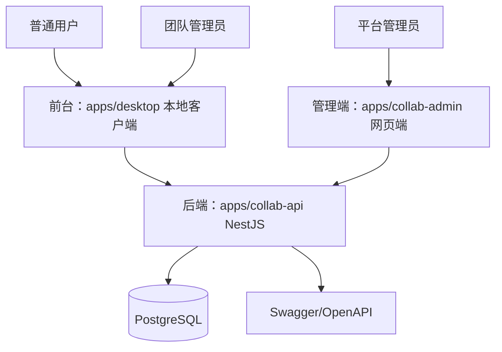
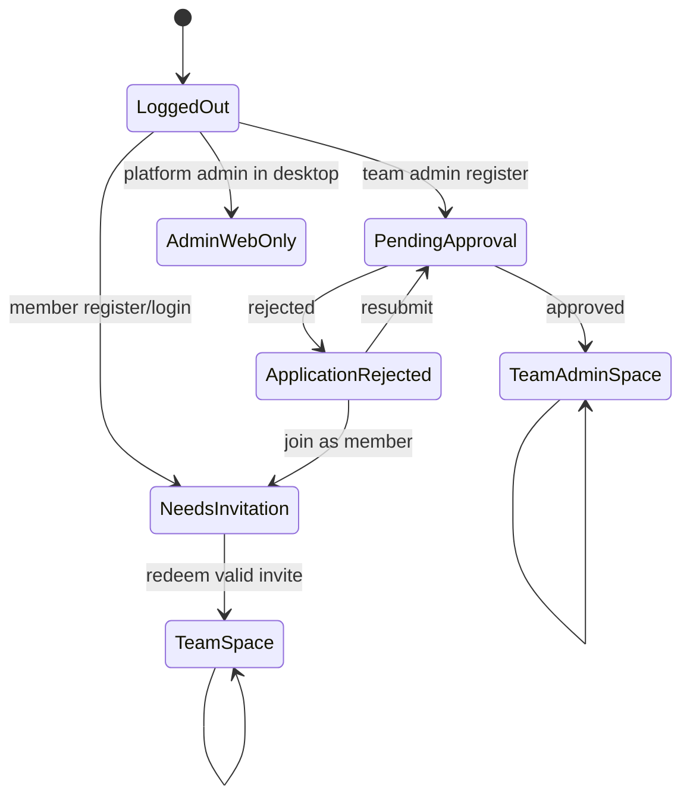

# 多租户协作平台技术设计

## Architecture

系统分为三个平台：



- `apps/desktop`：继续作为 Tauri 本地客户端。新增多租户协作前台状态，不新增普通用户 Web 应用。
- `apps/collab-admin`：新增平台管理员网页端。
- `apps/collab-api`：新增 NestJS API，统一认证、权限和业务状态。
- `PostgreSQL`：新平台唯一业务数据库。

## Boundaries

### Front Desk Local Client

负责：

- 普通用户注册、登录、邀请码加入团队。
- 团队管理员申请、审批状态查看。
- 团队空间、团队成员管理、邀请码管理。
- 团队余额和流水查看。
- 可用插件展示与调用。

不负责：

- 平台级用户管理。
- 跨团队管理。
- 团队余额调整。
- 插件启用/禁用。
- 审批处理。

### Admin Web

负责：

- 平台管理员登录。
- 仪表盘。
- 用户管理。
- 团队管理。
- 团队余额调整。
- 平台插件管理。
- 团队管理员申请审批。
- 审计日志查看。

不负责：

- 普通用户团队空间。
- 团队内资源使用。

### API

负责：

- 认证与会话。
- RBAC 与资源归属校验。
- Prisma schema、迁移、seed。
- 业务流程状态机。
- Swagger/OpenAPI。
- 统一错误格式。

## Data Model

### User

- `id`
- `email`
- `displayName`
- `passwordHash`
- `status`: `ACTIVE | DISABLED`
- `platformRole`: `PLATFORM_ADMIN | NONE`
- `createdAt`
- `updatedAt`

### Team

- `id`
- `name`
- `slug`
- `status`: `ACTIVE | SUSPENDED`
- `balanceCents`
- `createdAt`
- `updatedAt`

### TeamMembership

- `teamId`
- `userId`
- `role`: `TEAM_ADMIN | MEMBER`
- `status`: `ACTIVE | REMOVED`
- `joinedAt`

### TeamAdminApplication

- `id`
- `userId`
- `teamName`
- `reason`
- `status`: `PENDING | APPROVED | REJECTED`
- `reviewReason`
- `reviewedBy`
- `reviewedAt`
- `createdAt`

### InvitationCode

- `id`
- `teamId`
- `codeHash`
- `displayCodePrefix`
- `createdBy`
- `maxUses`
- `usedCount`
- `expiresAt`
- `status`: `ACTIVE | DISABLED | EXPIRED`
- `createdAt`

### BalanceLedger

- `id`
- `teamId`
- `amountCents`
- `direction`: `CREDIT | DEBIT`
- `reason`
- `actorUserId`
- `createdAt`

### Plugin

- `id`
- `name`
- `description`
- `status`: `ENABLED | DISABLED`
- `createdAt`
- `updatedAt`

### AuditLog

- `id`
- `actorUserId`
- `action`
- `targetType`
- `targetId`
- `metadata`
- `createdAt`

## State Flow



API 返回的 onboarding 状态是本地客户端页面切换的单一来源：

- `NEEDS_INVITATION`
- `PENDING_APPROVAL`
- `APPLICATION_REJECTED`
- `TEAM_SPACE`
- `TEAM_ADMIN_SPACE`
- `PLATFORM_ADMIN_WEB_ONLY`

## Authorization

### Token Strategy

- JWT 只作为身份凭证。
- JWT 内可包含 `sub`、`email`、`platformRole` 的轻量快照。
- 团队资源访问必须从数据库重新加载 membership。
- 平台管理接口必须从数据库确认 `PLATFORM_ADMIN`。

### Guards

- `JwtAuthGuard`：验证登录状态。
- `PlatformAdminGuard`：保护 `/admin/*`。
- `TeamMemberGuard`：保护当前团队资源。
- `TeamAdminGuard`：保护团队管理员操作。

### Isolation

- 团队域资源必须从当前用户 membership 推导或校验 `teamId`。
- `TEAM_ADMIN` 不得通过请求体指定任意团队。
- 管理端跨团队接口统一挂在 `/admin/*` 并使用平台管理员权限。

## API Shape

### Common

- `POST /auth/register`
- `POST /auth/login`
- `GET /auth/me`
- `POST /auth/refresh`
- `POST /auth/logout`

### Desktop Client

- `GET /me/onboarding`
- `POST /team-admin-applications`
- `GET /team-admin-applications/me`
- `POST /invitations/redeem`
- `GET /teams/current`
- `GET /teams/current/members`
- `DELETE /teams/current/members/:userId`
- `POST /teams/current/invitations`
- `GET /teams/current/invitations`
- `PATCH /teams/current/invitations/:id/disable`
- `GET /teams/current/balance`
- `GET /teams/current/balance-ledger`
- `POST /teams/current/consume`
- `GET /plugins/available`

### Admin Web

- `GET /admin/dashboard`
- `GET /admin/users`
- `POST /admin/users`
- `PATCH /admin/users/:id`
- `DELETE /admin/users/:id`
- `GET /admin/teams`
- `POST /admin/teams`
- `PATCH /admin/teams/:id`
- `POST /admin/teams/:id/admins`
- `DELETE /admin/teams/:id/admins/:userId`
- `POST /admin/teams/:id/balance-adjustments`
- `GET /admin/plugins`
- `POST /admin/plugins`
- `PATCH /admin/plugins/:id`
- `GET /admin/team-admin-applications`
- `POST /admin/team-admin-applications/:id/approve`
- `POST /admin/team-admin-applications/:id/reject`
- `GET /admin/audit-logs`

## Error Format

```json
{
  "code": "forbidden",
  "message": "权限不足",
  "requestId": "req_xxx",
  "details": {}
}
```

## Documentation

- Swagger UI：`/api/docs`。
- OpenAPI JSON：`/api/docs-json`。
- `docs/collab-platform.md`：架构与业务流程。
- `docs/collab-api.md`：静态 API 说明。
- `docs/collab-deployment.md`：部署与初始化。
- `docs/collab-desktop-client.md`：本地客户端接入。
- `docs/collab-admin-guide.md`：管理端使用说明。

## Compatibility

- 不移除旧 Rust/SQLite 服务端。
- 本地客户端现有后端 URL 配置继续保留，但新协作业务统一对接 `collab-api`。
- Tauri 本地能力网关暂不重写。
- 插件 SDK 底层能力模型暂不重写。

## Rollback

- 新增 `apps/collab-api` 和 `apps/collab-admin` 可整体回滚，不影响旧服务端。
- `apps/desktop` 改造集中在 React 层；若阻塞，可通过 Git diff 回滚相关页面和 API 类型变更。
- Docker 和文档以新增文件为主，避免破坏旧启动方式。
