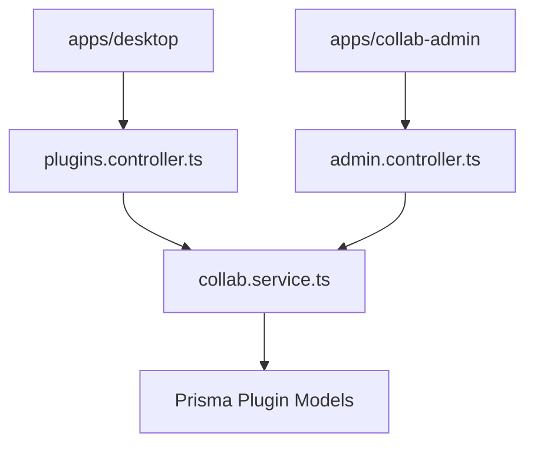

# 云端插件分享技术设计

## Scope

本任务只负责 `apps/collab-api` 云端插件成品能力：上传、团队共享、我的插件、可用插件、公共市场提交、平台审核和权限校验。

## Architecture



## Data Model

扩展 `Plugin`：

- identity: `id`, `name`, `description`, `version`, `entry`, `runtimeType`
- ownership: `teamId`, `authorUserId`
- artifact: `manifest`, `files`, `capabilities`
- publication: `visibility`, `reviewStatus`, `reviewReason`, `reviewedById`, `reviewedAt`, `marketplace`, `priceCents`
- stats: `installCount`, `ratingCount`, `ratingSum`
- lifecycle: `status`, `createdAt`, `updatedAt`

新增枚举建议：

- `PluginVisibility`: `TEAM | PUBLIC`
- `PluginReviewStatus`: `TEAM_SHARED | PENDING_REVIEW | APPROVED | REJECTED`
- `PluginRuntimeType`: `client | cloud`

可选新增模型：

- `PluginInstallation`
- `PluginReview`
- `PluginAuditEvent`

首轮可先不做复杂评分/安装模型，但字段设计不能阻塞后续扩展。

## API Contracts

### `POST /api/plugins/upload`

输入：

```json
{
  "manifest": {},
  "files": [{ "path": "manifest.json", "content": "..." }],
  "sourceDraftId": "optional",
  "visibility": "TEAM"
}
```

输出：

```json
{
  "plugin": {
    "id": "...",
    "reviewStatus": "TEAM_SHARED",
    "visibility": "TEAM"
  }
}
```

校验：

- 用户必须有 active team membership。
- manifest.id/name/version/entry 必须存在或可归一化。
- entry 文件必须存在。
- path 不能是绝对路径，不能含 `..`。
- 文件总大小和单文件大小必须受限。
- capability 必须来自 contract 白名单。

### `GET /api/plugins/mine`

返回当前用户创建和当前团队共享插件。

### `GET /api/plugins/available`

返回当前团队可运行插件：

- 当前团队共享插件。
- `PUBLIC + APPROVED + ENABLED` 插件。
- 后续可叠加安装记录。

### `POST /api/plugins/:id/submit-marketplace`

- 只有作者或团队管理员可提交。
- 状态变为 `PENDING_REVIEW`。
- 保存价格和 release notes。

### Admin APIs

- `GET /api/admin/plugins/review-pending`
- `POST /api/admin/plugins/:id/approve`
- `POST /api/admin/plugins/:id/reject`
- `PATCH /api/admin/plugins/:id`

## Permission Matrix

| Action                |           Member |       Team Admin | Author |  Platform Admin |
| --------------------- | ---------------: | ---------------: | -----: | --------------: |
| upload team plugin    | yes, in own team |              yes |    yes | no desktop flow |
| list team plugins     |              yes |              yes |    yes |  via admin only |
| submit marketplace    |   only if author | yes for own team |    yes |              no |
| approve/reject        |               no |               no |     no |             yes |
| disable public plugin |               no |               no |     no |             yes |

## Error Handling

Use existing `badRequest`, `forbidden`, `notFound`, `conflict` helpers. New errors should produce stable `code/message/requestId` through existing filter.

## Audit

Write audit entries for:

- `plugin.uploaded`
- `plugin.marketplace_submitted`
- `plugin.review_approved`
- `plugin.review_rejected`
- `plugin.disabled`

## Rollback

- Migration rollback removes added plugin metadata fields/models.
- Controller/service changes are isolated to plugin APIs.
- Existing auth/team/balance APIs remain untouched.
