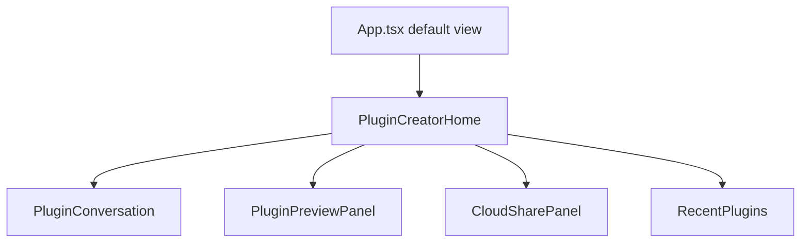
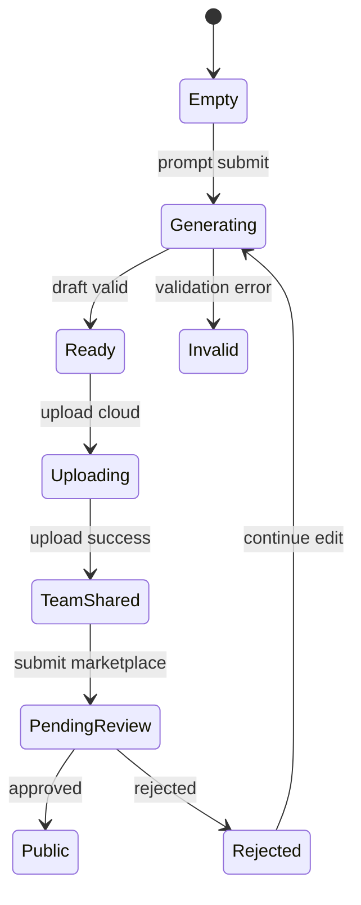

# 插件创建首页技术设计

## Scope

本任务只负责 `apps/desktop` 用户端 UI 与云端分享主流程：默认首页、对话式插件创建、预览、云端上传、市场提交、最近插件。

## Page Structure

## Components

- `PluginCreatorHome`
  - Hero: `今天想创建什么插件？`
  - Prompt input.
  - Tool/model picker.
  - Quick templates.

- `PluginConversation`
  - User messages.
  - Real CLI stream events.
  - Generation stages.
  - Error diagnostics.

- `PluginPreviewPanel`
  - iframe preview.
  - desktop/mobile preview width.
  - manifest summary.
  - capability badges.
  - diagnostics/source details.

- `CloudSharePanel`
  - `idle`
  - `ready_to_upload`
  - `uploading`
  - `team_shared`
  - `submitting_review`
  - `pending_review`
  - `public`
  - `rejected`

- `RecentPlugins`
  - recent run
  - recent create
  - recent upload
  - recent edit

## State Model

## API Dependencies

Existing:

- `POST /drafts`
- `streamGenerate()`
- preview helper in `Generator.tsx`

New cloud APIs from `cloud-plugin-sharing`:

- `POST /api/plugins/upload`
- `GET /api/plugins/mine`
- `POST /api/plugins/:id/submit-marketplace`
- `POST /api/plugins/:id/edit-draft`

Tauri APIs from `local-agent-runtime`:

- `code_assistant_list_tools`
- `code_assistant_start_session`
- `code_assistant_stop_session`

## UI Library

Use existing UI components. If a chat primitive is introduced, keep it minimal and shadcn-compatible.

## Local Recent Cache

Use tenant-scoped localStorage key shape:

- `lf:recentPlugins:<tenantId>`

Entries:

- plugin id
- name
- action
- source
- updatedAt
- reviewStatus

Cloud remains source of truth.

## Compatibility

- Keep team space and team manage pages reachable.
- Keep settings page reachable.
- Do not break existing plugin runner.
- Existing generated plugin preview should keep sandbox behavior.
