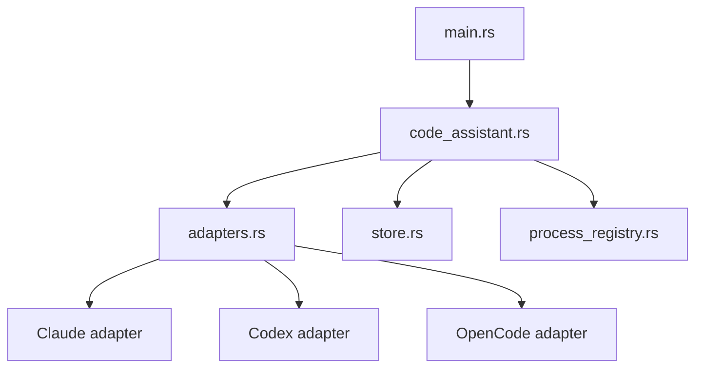

# 本地代码助手运行时技术设计

## Scope

本任务只负责 Tauri Rust 本地运行时。它不实现云端插件 API，不实现前端工作台 UI，只暴露 commands/events 供前端调用。

## Module Shape

## Commands

- `code_assistant_list_tools`
- `code_assistant_check_tool`
- `code_assistant_run_probe`
- `code_assistant_get_config`
- `code_assistant_save_config`
- `code_assistant_start_session`
- `code_assistant_send_input`
- `code_assistant_stop_session`
- `code_assistant_list_sessions`
- `code_assistant_read_transcript`

## Events

- `code-assistant://session-started`
- `code-assistant://output`
- `code-assistant://error`
- `code-assistant://exit`
- `code-assistant://availability-changed`

## Tool Definition

Each tool normalizes:

- `tool`: `claude | codex | opencode`
- `displayName`
- `candidateBinaries`
- `versionArgs`
- `probeArgs(prompt, model)`
- `runArgs(prompt, model, sessionId?)`
- `models`
- `defaultModel`

## Session Store

Persist under Tauri app data:

- config JSON
- sessions JSON
- transcripts JSONL
- process registry JSON

## Process Registry

Store:

- pid
- process group id if available
- session id
- tool
- command preview
- started at

Startup cleanup:

- SIGTERM first.
- Wait grace period.
- SIGKILL if still alive.
- Record survivors as blocked diagnostics.

## Real CLI Probe

`code_assistant_run_probe` must run the real CLI with a minimal prompt. It cannot be satisfied by `--help` only.

Probe output includes:

- command preview
- stdout tail
- stderr tail
- exit code
- elapsed ms
- transcript path
- success/failure

## Security

- Workspace path must be explicit.
- Do not run shell through unescaped concatenated command strings.
- Prefer direct process invocation with args array.
- Redact configured secrets from command preview and logs.
- Kill child process tree on stop/exit.

## Rollback

The runtime can be hidden from UI while still compiled. Existing plugin loading and `invoke_capability` must remain compatible.