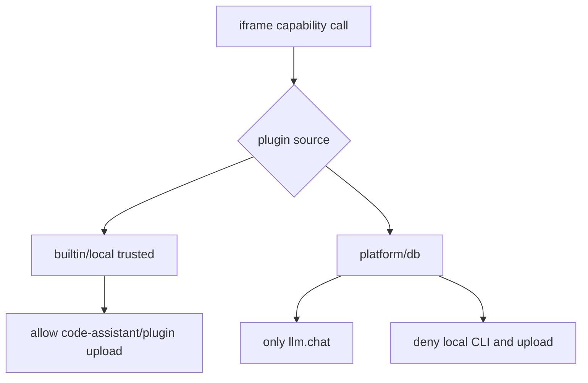

# 插件能力与 SDK 技术设计

## Scope

本任务负责跨包契约和运行时桥：`packages/contract`、`packages/plugin-sdk`、`apps/desktop/src/pages/plugins-runtime.ts`。不实现云端后端业务，不实现 Tauri CLI runtime。

## Capability Additions

新增 capability kinds:

- `code-assistant.run`
- `code-assistant.session`
- `plugin.upload`
- `plugin.submitMarketplace`

## SDK Shape

```ts
sdk.codeAssistant.check(input)
sdk.codeAssistant.run(input)
sdk.codeAssistant.stop(sessionId)
sdk.plugin.upload(input)
sdk.plugin.submitMarketplace(input)
```

## Runtime Policy



## Input Contracts

### `code-assistant.run`

- tool: `claude | codex | opencode`
- model: string
- prompt: string
- workspacePath: string
- timeoutMs?: number

### `plugin.upload`

- manifest: object
- files: `{ path, content }[]`
- sourceDraftId?: string

### `plugin.submitMarketplace`

- pluginId: string
- priceCents: number
- releaseNotes?: string

## Error Contracts

- Bridge missing: keep existing explicit error style.
- Unsupported source: `运行态暂不支持的能力：<kind>`.
- Remote plugin blocked: `该能力仅限本地受信任插件使用`.

## Compatibility

- Existing `llm.chat` behavior must remain unchanged.
- Existing builtin plugin capability path remains through Tauri `invoke_capability`.
- Existing database plugin runtime remains restricted.

## Rollback

All additions are additive. If local runtime blocks, UI can hide new SDK methods while existing SDK stays valid.