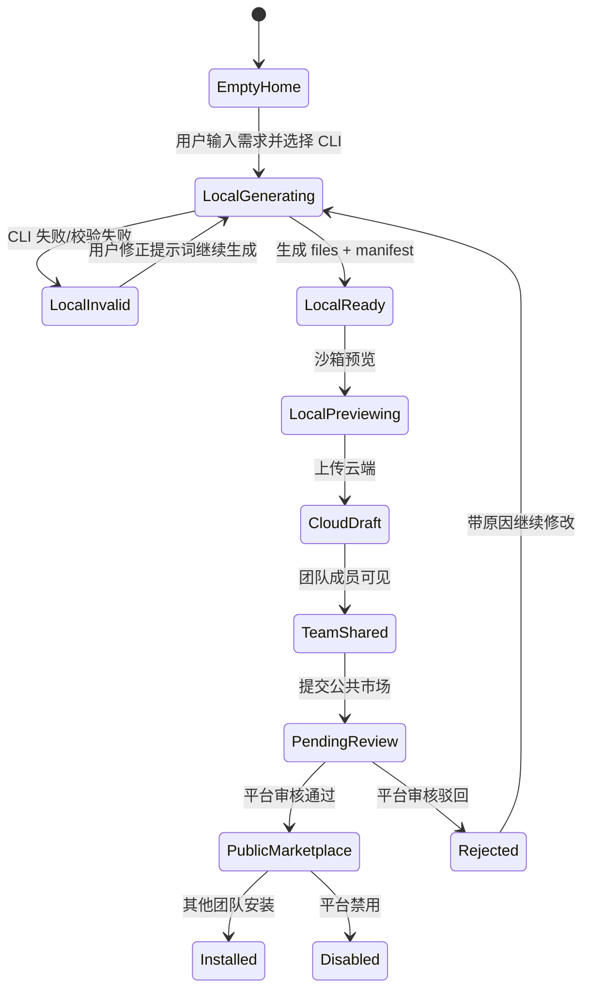
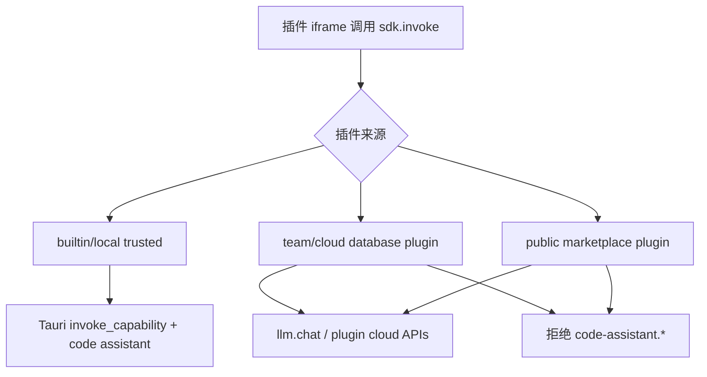
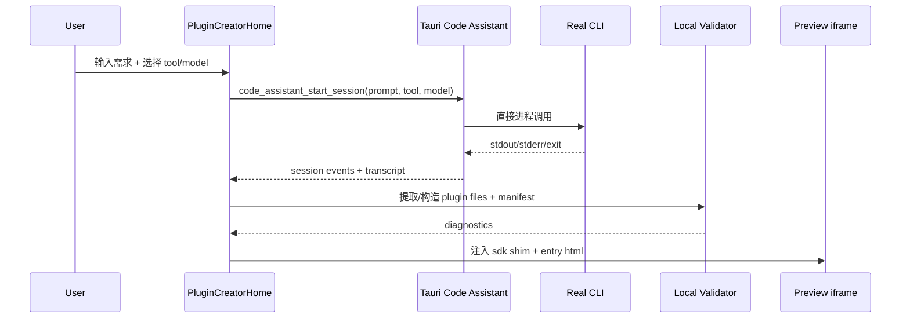
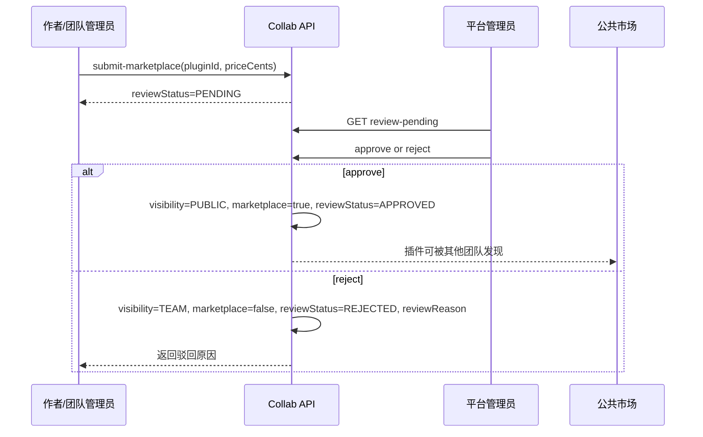

# LingFang 插件系统详细设计

## 1. 设计目标

LingFang 的插件系统要把“自然语言描述需求”变成“可运行、可分享、可审核、可治理的插件成品”。本设计覆盖桌面端插件创建首页、本地代码助手运行时、插件能力 SDK、云端团队共享、公共市场审核、管理端治理和真实 CLI 验证。

核心目标：

- 用户登录桌面端后，默认进入插件创建体验，而不是先进入一个空的管理页面。
- 用户可以用 Claude Code、Codex、OpenCode 等真实本机 CLI 生成插件，不使用 mock、不使用固定样例伪装生成结果。
- AI 生成结果必须落成 LingFang 标准插件包：`manifest.json`、入口 HTML、资源文件、能力声明和诊断信息。
- 插件先在本地沙箱预览，确认后上传到云端成为团队共享插件。
- 团队共享插件可被同团队成员看到、运行和继续编辑。
- 作者或团队管理员可提交插件到公共市场审核。
- 平台管理员审核通过后，插件成为公共市场插件，其他团队可搜索、安装、运行。
- 插件运行时能力必须经过宿主、manifest、用户/团队授权的分层控制，远程插件默认不能控制本机 CLI。

## 2. 非目标

首轮不做以下内容，避免把插件设计扩大成不可交付的平台重写：

- 不做多 Agent 协同编排、任务拆解队列或云端 Agent 运行集群。
- 不做云端运行 Claude Code、Codex、OpenCode；这些工具只在用户本机 Tauri runtime 中运行。
- 不允许远程公共市场插件默认调用本机代码助手能力。
- 不做真实支付、提现、税务、分账或复杂付费结算。
- 不做多人同时编辑同一个插件草稿。
- 不做市场级插件代码签名；保留未来字段和审核接口，但首轮用审核状态和内容 hash 治理。
- 不引入第二套大型 UI 框架；桌面端继续使用当前 React、Tailwind、shadcn/base-ui 风格组件。

## 3. 当前系统事实

当前仓库已经具备插件系统的若干基础：

- `packages/contract/src/plugin.ts` 是插件 manifest、capability、Plugin、Installation、Grant 的 TypeScript/Zod 契约来源。
- `packages/plugin-sdk/src/index.ts` 已有 `sdk.invoke`、`sdk.llm.chat`、`sdk.codeAssistant.*`、`sdk.plugin.*` 的薄桥接形态。
- `apps/desktop/src/pages/plugins-runtime.ts` 已区分 builtin/local trusted 插件与 database/platform 插件，并默认阻止云端插件调用本地代码助手。
- `apps/desktop/src-tauri/src/capability.rs` 已有 manifest 声明和路径作用域校验，当前重点支持 `fs.read` 与 `system.info`。
- `apps/desktop/src-tauri/src/code_assistant.rs` 和子模块已经定义本地 CLI 工具发现、probe、session、transcript、process registry 的运行时骨架。
- `apps/collab-api/prisma/schema.prisma` 已扩展 `Plugin`、`PluginInstallation`、`PluginReview` 和 `AuditLog`，支持团队归属、作者、文件、manifest、capabilities、review status、marketplace 和安装。
- `apps/collab-api/src/modules/plugins.controller.ts` 已暴露插件上传、我的插件、可用插件、提交市场、编辑草稿、安装市场插件。
- `docs/adr/0004-plugin-capability-sandbox.md` 已明确插件沙箱采用 Tauri 2 WebView/iframe、零直连、三重 capability 校验和主题统一。

本设计不把这些实现当作最终完成，而是把它们固化为需要对齐、补全和验证的目标架构。

## 4. 总体架构

```mermaid
flowchart TD
  User[用户] --> Desktop[apps/desktop React 工作台]
  Desktop --> Preview[iframe 沙箱预览/运行]
  Desktop --> Tauri[apps/desktop/src-tauri 本地能力网关]
  Tauri --> CLI[Claude Code / Codex / OpenCode]
  Desktop --> Collab[apps/collab-api NestJS 协作 API]
  Collab --> PG[(PostgreSQL)]
  Admin[apps/collab-admin 管理端] --> Collab
  Preview --> SDK[@lingfang/plugin-sdk]
  SDK --> RuntimeBridge[plugins-runtime.ts bridge]
  RuntimeBridge --> Tauri
  RuntimeBridge --> Collab
```

分层职责：

- 桌面前端负责插件创建体验、会话状态、预览、上传、提交审核和运行已安装插件。
- Tauri 后端负责本机 CLI、内置插件、文件/系统本地 capability 和进程清理。
- SDK 只负责把插件代码里的能力调用转发给宿主，不持久化数据，不保存密钥，不做租户鉴权。
- 协作 API 负责团队身份、云端插件持久化、市场审核、安装、审计和权限过滤。
- 管理端负责平台级插件治理、公共市场审核、禁用、价格和描述维护。

## 5. 子系统边界

LingFang 插件工作台由五个可独立交付的子系统组成：

| 子系统 | 目录 | 责任 | 不负责 |
| --- | --- | --- | --- |
| 插件创建首页 | `apps/desktop/src` | 首页、对话生成、预览、云端分享、最近插件 | 本机进程实现、云端审核规则 |
| 本地代码助手运行时 | `apps/desktop/src-tauri` | CLI 发现、probe、session、transcript、进程 registry | 团队权限、市场审核 |
| 插件能力与 SDK | `packages/contract`、`packages/plugin-sdk`、`plugins-runtime.ts` | 能力名、类型、桥接策略、运行态限制 | 业务持久化、CLI adapter 细节 |
| 云端插件分享 | `apps/collab-api` | 上传、团队共享、公共审核、安装、审计 | 本机 CLI 运行、iframe 渲染 |
| 真实 CLI 验证 | `docs/plugin-workbench-real-cli-test.md` | 记录真实命令、版本、模型、结果、截图/日志 | 替代自动化测试 |

这个边界避免把本地工具运行和云端多租户治理混在一起。远程 API 只接收插件成品，不接管用户机器上的代码助手。

## 6. 插件产品生命周期



生命周期里的状态必须有明确 UI 表达：

- `LocalGenerating`：展示 CLI 输出流、当前阶段、命令预览、session id。
- `LocalInvalid`：展示失败来源，包括 CLI、manifest、entry、capability、上传校验或审核驳回。
- `LocalReady`：允许预览、查看源码、上传团队共享。
- `TeamShared`：显示云端 plugin id、团队可见状态、最近更新时间。
- `PendingReview`：禁止编辑该插件，避免审核对象和作者本地版本不一致。
- `Rejected`：显示驳回理由，允许作者或团队管理员继续编辑后重新提交。
- `PublicMarketplace`：显示公共市场状态，允许其他团队安装。

## 7. 插件包格式

LingFang 插件包是一个可序列化文件集合，至少包含：

```text
plugin/
├── manifest.json
├── ui/index.html
├── ui/main.js          optional
├── ui/styles.css       optional
└── README.md           optional
```

云端上传体使用结构化 JSON，而不是 zip 文件：

```ts
type PluginFile = {
  path: string;
  content: string;
};

type PluginUploadInput = {
  manifest: PluginManifest;
  files: PluginFile[];
  sourceDraftId?: string;
  priceCents?: number;
};
```

设计约束：

- `files` 中必须存在 `manifest.json`，也必须存在 `manifest.entry` 指向的文件。
- 服务端以请求体里的结构化 `manifest` 为准，同时建议校验 `manifest.json` 文件内容与结构化 manifest 的关键字段一致。
- 文件路径是包内相对路径，统一 `/` 分隔，禁止绝对路径、`~`、Windows 盘符、空段、`.`、`..` 和隐藏系统路径段。
- 单文件上限 256 KiB，整包上限 2 MiB，最多 80 个文件。
- 同团队相同 `contentHash` 去重，返回已有插件并标记 `deduplicated: true`。

## 8. Manifest 契约

Manifest 是插件可运行性的核心契约。当前目标字段：

```ts
type RuntimeType = 'client' | 'cloud';

type PluginManifest = {
  id: string;
  name: string;
  version: string;
  description: string;
  runtime_type: RuntimeType;
  entry: string;
  visibility: 'private' | 'tenant';
  capabilities: PluginCapability[];
};
```

字段规则：

- `id`：插件作者可控的稳定标识，用于 UI 展示、未来签名和升级匹配；云端数据库仍使用独立 uuid。
- `name`：用户可读插件名，不能为空。
- `version`：语义版本优先，首轮只校验非空，不强制 semver。
- `runtime_type`：首轮主要支持 `client`；`cloud` 是未来云端执行的保留位。
- `entry`：必须指向包内存在的 HTML 文件。
- `visibility`：插件包本身只能声明 `private` 或 `tenant`；公共市场状态由审核流程提升到 `PUBLIC`，不能由上传者直接声明。
- `capabilities`：必须是 contract 白名单内的能力，不能有未知 kind。

## 9. 能力模型

能力声明描述插件希望宿主代为执行的越权操作：

```ts
type PluginCapability = {
  kind: CapabilityKind;
  reason: string;
  risk: 'none' | 'low' | 'medium' | 'high';
  requires_admin: boolean;
  scope?: Record<string, unknown>;
};
```

当前能力集合：

- UI 与基础能力：`ui.view`、`clipboard`、`storage.kv`
- 文件能力：`fs.pick`、`fs.read`、`fs.write`
- 网络能力：`net.fetch`
- 模型能力：`llm.chat`
- 系统能力：`system.info`、`system.screenshot`、`system.notify`
- 本地代码助手：`code-assistant.run`、`code-assistant.session`
- 插件云端操作：`plugin.upload`、`plugin.submitMarketplace`

风险规则：

- `risk: none`：纯展示或不触及外部状态，例如 `ui.view`。
- `risk: low`：可撤销、低敏感操作，例如读取插件自己的 KV。
- `risk: medium`：可能读取用户数据或消耗团队资源，例如 `fs.read`、`llm.chat`。
- `risk: high`：可能写文件、截屏、发网络请求、控制本地 CLI，例如 `fs.write`、`system.screenshot`、`code-assistant.run`。

高风险能力默认应该 `requires_admin: true`。AI 生成插件时如果声明高风险能力但没有理由，校验应失败或要求重新生成 manifest。

## 10. SDK 设计

`@lingfang/plugin-sdk` 只能是类型化 bridge，不引入业务状态：

```ts
sdk.fs.pick({ accept: ['.pdf', '.txt'] });
sdk.fs.read(path);
sdk.fs.write(path, content);
sdk.llm.chat({ messages, model });
sdk.system.screenshot();
sdk.codeAssistant.check({ tool: 'codex' });
sdk.codeAssistant.run({ tool: 'codex', model: 'default', prompt, workspaceDir });
sdk.plugin.upload({ manifest, files });
sdk.plugin.submitMarketplace({ pluginId, priceCents });
```

SDK 规则：

- SDK 不能保存 API key、base URL、JWT、团队信息或本地路径白名单。
- SDK 不做授权判断，只把 capability kind 和 args 发送给宿主注入的 `__lingfangInvoke`。
- SDK 的 public API 必须和 `packages/contract/src/plugin.ts` 的 capability kind 对齐。
- 任何新增能力必须先更新 contract，再更新 SDK，再更新桌面 runtime 和云端/本地执行器。
- Bridge 未注入时抛出显式错误：`capability bridge 未注入: <kind>`。

## 11. 运行时 Bridge 策略

桌面端 iframe 运行时分两类：



策略：

- 内置插件和本地受信任工作台插件可以调用本地 Tauri capability，也可以触发本地代码助手。
- 团队云端插件和公共市场插件默认只能调用 `llm.chat` 以及明确允许的云端插件 API。
- 云端插件调用 `code-assistant.run` 或 `code-assistant.session` 时必须失败，错误文案明确说明该能力仅限本地受信任插件或未来管理员授权。
- `plugin.upload` 和 `plugin.submitMarketplace` 是宿主工作台能力，不应给普通公共市场插件开放成“自我发布”能力；首轮只给本地创建工作台路径使用。
- runtime message 必须带 request id，reply 必须只返回 result 或 error，避免 iframe 内 promise 永久挂起。

## 12. 沙箱与隔离

插件运行在受限 iframe 或 Tauri 2 WebView 中。安全目标是“插件代码可以坏，但不能越过宿主网关坏到用户系统或租户数据”。

隔离要求：

- iframe 使用 `sandbox`，默认不开放顶层导航。
- CSP 禁止任意远程脚本，禁止直接 `fetch` 外网，网络请求走 `net.fetch` capability。
- 插件不能直接读取宿主 localStorage、JWT、API base URL 或 Tauri invoke。
- 插件不能直接调用 Node、Rust、shell 或浏览器扩展 API。
- 宿主只注入最小 bridge：`__lingfangInvoke`、兼容旧插件的 `LingFangBridge.invokeCapability`、必要的 `sdk` shim。

预览态和运行态都必须使用同类隔离。预览不能因为“只是草稿”而放宽沙箱，否则 AI 生成过程中的错误代码会成为真实攻击面。

## 13. 三重 Capability 校验

能力执行必须满足三层校验：

1. 平台/宿主允许：Tauri command、desktop runtime 或 server API 确实支持该能力。
2. 插件声明：`manifest.capabilities` 中声明了该能力，必要 scope 存在且格式正确。
3. 用户/团队授权：当前用户、团队角色、安装记录、管理员审批或高风险授权允许该调用。

首轮当前状态：

- Tauri 已具备 manifest 声明和路径作用域校验能力。
- 云端已具备团队成员、作者、团队管理员、平台管理员等鉴权基础。
- PluginGrant 的完整安装授权模型可以后置，但设计上必须保留 deny 优先、user 优先于 role、owner/admin 默认可管理的解析规则。

远程插件高风险能力的默认行为：

- `fs.read`、`fs.write`、`system.screenshot`、`code-assistant.*` 默认拒绝。
- `llm.chat` 允许走服务端 `/llm/proxy`，由服务端按租户绑定、余额和审计控制。
- `net.fetch` 首轮默认拒绝或只允许白名单域名；不能让插件绕过平台后端直接访问任意网络。

## 14. 插件生成流程

插件创建首页的生成流程：



生成结果应该尽量要求 CLI 产出标准插件包，而不是把 CLI 自由文本简单塞进 `<pre>`。如果 CLI 没有返回完整插件包，工作台可以构造“诊断插件草稿”作为 fallback，但该 fallback 不应被标记为完整生成成功。

推荐 prompt 约束：

- 明确要求输出 `manifest.json` 和 `ui/index.html`。
- 明确可用 capability 白名单。
- 明确禁止远程 script、绝对路径、外部 key、未声明能力。
- 明确 UI 使用 LingFang design token 或系统字体，不硬编码复杂主题。
- 明确输出格式使用带文件路径的 fenced code block 或 JSON 文件列表，便于解析。

## 15. 本地代码助手运行时

Tauri runtime 负责真实工具调用，不能用 fake adapter 替代。

Commands：

- `code_assistant_list_tools`
- `code_assistant_check_tool`
- `code_assistant_run_probe`
- `code_assistant_get_config`
- `code_assistant_save_config`
- `code_assistant_start_session`
- `code_assistant_send_input`
- `code_assistant_stop_session`
- `code_assistant_list_sessions`
- `code_assistant_read_transcript`

Events：

- `code-assistant://session-started`
- `code-assistant://output`
- `code-assistant://error`
- `code-assistant://exit`
- `code-assistant://availability-changed`

Adapter 统一输出：

- `tool`: `claude | codex | opencode`
- `displayName`
- `candidateCommands`
- `versionArgs`
- `models`
- `defaultModel`
- `commandPreview`
- `workspaceDir`
- `transcriptPath`
- `pid`
- `exitCode`
- `diagnostics`

实现规则：

- 使用直接进程调用和 args 数组，不通过 shell 拼接命令字符串。
- command preview 只展示安全参数，未来如出现 token 必须脱敏。
- workspace 必须显式传入或来自配置，不能隐式运行在任意目录。
- session 结束时写入 exit code、endedAt，并从 process registry 移除。
- 应用启动时清理上次残留进程，先 graceful terminate，再强制 kill，记录清理结果。

## 16. CLI Adapter 细节

当前工具定义：

| 工具 | binary | probe/run 形态 | 默认模型 |
| --- | --- | --- | --- |
| Claude Code | `claude` | `claude -p <prompt> --model <model>` | `sonnet` |
| Codex | `codex` 或 `npx --no-install @openai/codex` | `codex exec <prompt> --model <model>` | `default` |
| OpenCode | `opencode` | `opencode run <prompt> --model <model>` | `default` |

Adapter 要求：

- `--version` 只证明二进制存在，不证明工具可用。
- `run_probe` 必须用真实最小 prompt 获取真实响应，不能只跑 `--help`。
- 模型为 `default` 时可以省略 `--model`，由 CLI 自身配置决定。
- 不同 CLI 的 stderr 不一定代表失败，最终结果必须结合 exit code、stdout/stderr 和 transcript。
- 如果工具需要登录或授权，probe 失败时保留 stdout/stderr tail，UI 展示“未认证/模型不可用/二进制缺失”等真实诊断。

## 17. Transcript 与运行证据

每次本地 CLI session 都要写 transcript JSONL：

```json
{"at":"...","event":"started","payload":{"sessionId":"...","tool":"codex","commandPreview":["codex","exec","..."]}}
{"at":"...","event":"output","payload":{"stream":"stdout","text":"..."}}
{"at":"...","event":"output","payload":{"stream":"stderr","text":"..."}}
{"at":"...","event":"exit","payload":{"exitCode":0}}
```

证据用途：

- 用户可以在 UI 中看到真实生成过程。
- 开发者可以复盘 CLI 失败原因。
- 最终真实 CLI 验证文档可引用 transcript 路径。
- 云端上传和市场审核结果可以和本地生成 session 关联。

数据保留：

- transcript 默认存储在 Tauri app data 下。
- UI 只展示 tail 或摘要，避免巨大输出拖垮页面。
- 用户未来可以清理历史 session；首轮至少要保证不会无限增长到影响启动。

## 18. 桌面首页信息架构

`PluginCreatorHome` 是登录并完成 onboarding 后的默认工作台。

布局建议：

- 顶部主输入区：标题“今天想创建什么插件？”，对话输入框，发送按钮，工具和模型选择。
- 工具状态区：Claude Code、Codex、OpenCode 可用性、版本、默认模型、probe 按钮。
- 生成过程区：用户消息、CLI 输出、阶段状态、错误诊断、停止按钮。
- 预览区：iframe 预览、桌面/移动宽度切换、刷新按钮。
- 源码区：文件列表、当前文件内容、manifest 摘要、能力 badge。
- 分享区：上传团队共享、提交市场审核、审核状态、驳回原因。
- 最近插件区：最近创建、运行、上传、继续编辑的插件。

UI 状态不应依赖隐式文本判断。建议显式建模：

```ts
type CreatorState =
  | 'empty'
  | 'checking_tools'
  | 'generating'
  | 'validating'
  | 'ready'
  | 'invalid'
  | 'uploading'
  | 'team_shared'
  | 'submitting_review'
  | 'pending_review'
  | 'public'
  | 'rejected';
```

## 19. 预览与源码诊断

预览不是简单展示 HTML，而是生成质量门：

- manifest 解析成功。
- entry 文件存在。
- entry HTML 能在 iframe 中渲染。
- SDK shim 注入成功。
- 运行时调用未知 capability 会返回清晰错误。
- capability badges 和 manifest 中的声明一致。
- 校验错误能回流给用户，用户可继续让 CLI 修改。

源码诊断至少包含：

- `schema`：manifest 字段和 capability enum 合法。
- `package`：文件路径、重复文件、entry 缺失、大小限制。
- `sandbox`：禁止远程 script、顶层跳转、直接 fetch 或可疑内联行为。
- `runtime`：SDK 调用是否有对应 capability 声明。
- `cloud`：上传前是否满足云端校验。

如果诊断失败，UI 仍可允许用户查看源码和 transcript，但上传按钮应禁用或显示明确风险。

## 20. 云端数据模型

当前 Prisma 设计应作为云端插件成品的主模型：

```prisma
model Plugin {
  id            String
  name          String
  description   String
  version       String
  entry         String
  runtimeType   PluginRuntimeType
  status        PluginStatus
  visibility    PluginVisibility
  teamId        String?
  authorUserId  String?
  files         Json
  manifest      Json
  capabilities  Json
  contentHash   String
  reviewStatus  PluginReviewStatus
  reviewReason  String
  reviewedById  String?
  reviewedAt    DateTime?
  marketplace   Boolean
  priceCents    Int
  installCount  Int
  ratingCount   Int
  ratingSum     Int
}
```

枚举语义：

- `PluginStatus.ENABLED`：插件可被正常发现和运行。
- `PluginStatus.DISABLED`：平台或团队禁用，运行入口应隐藏或阻止。
- `PluginVisibility.PRIVATE`：仅作者在团队内可见。
- `PluginVisibility.TEAM`：同团队成员可见。
- `PluginVisibility.PUBLIC`：公共市场可见，必须由审核通过产生。
- `PluginReviewStatus.DRAFT`：团队共享但未提交市场。
- `PluginReviewStatus.PENDING`：等待平台审核。
- `PluginReviewStatus.APPROVED`：通过审核。
- `PluginReviewStatus.REJECTED`：审核驳回。

索引和约束：

- `@@unique([teamId, contentHash])` 支持团队内重复上传去重。
- `@@index([teamId, status, visibility])` 支持团队插件列表。
- `@@index([marketplace, reviewStatus, status])` 支持公共市场和审核列表。

## 21. 云端 API 契约

前台插件 API：

| 方法 | 路径 | 说明 |
| --- | --- | --- |
| `POST` | `/api/plugins/upload` | 上传插件包到当前团队 |
| `GET` | `/api/plugins/mine` | 当前用户创建的插件 |
| `GET` | `/api/plugins/available` | 当前团队可运行插件 |
| `POST` | `/api/plugins/:id/submit-marketplace` | 作者或团队管理员提交市场审核 |
| `POST` | `/api/plugins/:id/edit-draft` | 编辑未审核中的团队插件 |
| `POST` | `/api/plugins/:id/install` | 安装已审核公共市场插件 |

管理端插件 API：

| 方法 | 路径 | 说明 |
| --- | --- | --- |
| `GET` | `/api/admin/plugins` | 平台插件列表 |
| `GET` | `/api/admin/plugins/review-pending` | 待审核市场插件 |
| `POST` | `/api/admin/plugins/:id/approve` | 审核通过 |
| `POST` | `/api/admin/plugins/:id/reject` | 审核驳回 |
| `PATCH` | `/api/admin/plugins/:id` | 禁用、改描述、改价格 |

响应原则：

- 成功响应用 `{ plugin }`、`{ plugins }`、`{ installation }` 等稳定外层字段。
- 错误走统一 `{ code, message, requestId, details }` 格式。
- `publicPlugin` 输出同时提供 `runtimeType` 和 `runtime_type`，兼容前端当前使用。
- 返回 `source`：`team | marketplace | platform`，前端用于运行策略和 UI badge。

## 22. 上传校验

`POST /api/plugins/upload` 的校验是公共市场安全的第一道门。

校验规则：

- 请求用户必须有 active current team membership。
- team 必须是 `ACTIVE`。
- `manifest` 必须是对象，`files` 必须是非空数组。
- `manifest.name`、`manifest.version`、`manifest.entry` 不能为空。
- `runtime_type` 只能是 `client` 或 `cloud`。
- 上传时 `visibility` 只能是 `tenant` 或 `private`，不能直接变成 public。
- 每个 `file.path` 经过 `cleanPath` 归一化并校验。
- 文件内容必须是字符串。
- 文件数量、单文件大小、总包大小都必须受限。
- capability kind 必须属于 contract 白名单。
- capability risk 必须属于 `none | low | medium | high`。
- entry 文件必须存在。
- 内容 hash 使用归一化后的 manifest 和排序后的 files 计算。

建议补充校验：

- `manifest.json` 文件内容必须能 JSON.parse。
- `manifest.json` 中的 `id/name/version/entry/capabilities` 应与请求体 manifest 一致，或由服务端重写文件内容。
- HTML 中禁止明显的远程 `<script src="http...">`，首轮可做保守静态检查。
- `code-assistant.*` capability 不允许云端市场插件声明，除非未来有单独授权设计。

## 23. 权限矩阵

| 操作 | 普通团队成员 | 作者 | 团队管理员 | 平台管理员 |
| --- | ---: | ---: | ---: | ---: |
| 上传团队插件 | yes | yes | yes | no desktop flow |
| 查看团队共享插件 | yes | yes | yes | admin list only |
| 编辑自己插件 | no | yes | yes | no |
| 编辑他人团队插件 | no | no | yes | no |
| 提交市场审核 | no | yes | yes | no |
| 安装公共插件 | yes | yes | yes | no desktop flow |
| 审核通过/驳回 | no | no | no | yes |
| 禁用公共插件 | no | no | no | yes |
| 读取其他团队私有插件 | no | no | no | admin list only |

关键规则：

- 团队成员只能读取自己当前团队的 `TEAM` 插件、自己创建的 `PRIVATE` 插件、已安装或已公开审核通过的插件。
- 非作者且非团队管理员不能提交他人插件到公共市场。
- 审核中的插件不能编辑，避免审核对象漂移。
- 平台管理员在管理端治理公共市场，不通过桌面端创建插件。

## 24. 市场审核流程



审核通过条件建议：

- manifest、entry、capability 校验通过。
- 插件能在沙箱中渲染。
- 没有明显恶意代码、假冒品牌、外部密钥、违法内容或高风险能力滥用。
- 高风险能力有清楚 `reason`，且公共市场首轮默认不开放本机代码助手能力。

审核驳回必须写 `reviewReason`，不能只写“未通过”。作者端用该原因继续修改并重新上传。

## 25. 插件安装与可用列表

`GET /api/plugins/available` 是桌面端插件列表的主要来源。返回范围：

- 当前团队 `visibility=TEAM` 且 `status=ENABLED` 的插件。
- 当前用户在团队内创建的 `visibility=PRIVATE` 插件。
- `marketplace=true`、`reviewStatus=APPROVED`、`visibility=PUBLIC`、`status=ENABLED` 的公共插件。
- 当前团队有 `PluginInstallation(status=ENABLED)` 的插件。

安装行为：

- 安装公共市场插件时创建或恢复 `PluginInstallation`。
- 安装时记录安装人、团队、版本和安装时间。
- 插件 install count 只在首次安装时递增，恢复安装不应重复夸大。
- 首轮可以把公共插件直接列在 available 中；后续如果需要“必须安装后可运行”，可以用 installation 过滤强化。

## 26. LLM 运行能力

`llm.chat` 是插件运行时最重要的云端能力。

约束：

- 插件调用 `sdk.llm.chat({ messages, model })`，不传 API key、base URL 或供应商凭据。
- 桌面 runtime 将云端插件的 `llm.chat` 转发到服务端 `/llm/proxy`。
- 服务端按当前用户、团队、插件、模型绑定、余额和审计策略执行。
- 插件不能直接 `fetch` OpenAI、Anthropic 或其他模型服务。
- prompt 和输出是否进入审计要遵守产品隐私策略；首轮至少要审计调用事实、状态、错误，不把密钥暴露到前端。

`llm.chat` 失败时要返回可操作错误：

- 团队没有模型绑定。
- 余额不足。
- 模型不可用。
- 插件未声明 `llm.chat`。
- 服务端代理失败。

## 27. 本地代码助手能力安全策略

`code-assistant.*` 是高风险能力，因为它能在用户机器上运行真实开发工具。

首轮策略：

- 只有 LingFang 本地插件创建工作台和内置受信任插件可以调用。
- 云端团队插件和公共市场插件默认被拒绝。
- 拒绝错误必须明确：`云端/平台插件默认不能调用本地代码助手能力，请使用内置可信插件或完成团队管理员授权。`
- 未来开放前必须增加安装时授权、工作区 scope、命令预览确认、管理员审批和审计。

安全要求：

- prompt 不是 shell 命令，不能拼到 shell 字符串里执行。
- workspaceDir 必须可见并可确认。
- session 可停止，停止要清理进程树。
- transcript 不能记录明文密钥。
- UI 要展示 command preview 和 session id，用户知道本机正在运行哪个工具。

## 28. 本地存储与最近插件

桌面端最近插件用于工作效率，不是云端事实来源。

推荐 key：

```text
lf:recent-plugins:<tenantId>
```

Entry 字段：

- `id`
- `name`
- `version`
- `source`
- `action`: `created | uploaded | submitted | run | edited`
- `reviewStatus`
- `reviewReason`
- `updatedAt`
- `transcriptPath?`

规则：

- 最近插件最多保留 8 到 20 条。
- 团队切换时使用不同 key，避免跨团队泄漏。
- 云端插件列表加载成功后，recent 中同 id 条目可以用云端状态刷新。
- localStorage 不可用时静默降级，不影响主流程。

## 29. 前后端类型对齐

契约单一事实来源仍是 `packages/contract`，但当前存在跨运行时手工字段：

- Prisma 使用 `runtimeType`、`reviewStatus`、`priceCents` 等 camelCase。
- Manifest 使用 `runtime_type`。
- 前端 `LoadedPlugin` 同时接收 `runtimeType` 和 `runtime_type`。
- Rust/Tauri command 使用 serde alias 兼容 snake/camel。

对齐规则：

- 新增 capability kind 先改 `packages/contract/src/plugin.ts`。
- SDK 方法名和 capability kind 必须一一对应。
- 云端返回给前端的 plugin DTO 应稳定，不直接暴露 Prisma 内部枚举细节给 UI 做复杂判断。
- 前端 UI 状态使用自己的窄类型，不在组件里到处比较任意字符串。
- Rust command 输入输出通过 serde alias 兼容已有前端命名，但新字段优先 camelCase 给 TypeScript 使用。

## 30. 错误处理

错误按层分责：

- Tauri CLI 错误：二进制不存在、版本检查失败、probe 失败、session 启动失败、进程停止失败、transcript 读取失败。
- 插件校验错误：manifest 缺字段、entry 缺失、路径不合法、capability 未知、大小超限。
- 云端权限错误：未登录、无团队、团队禁用、非作者/非管理员、其他团队资源。
- 审核状态错误：审核中不可编辑、非 PENDING 不可审批、已禁用不可提交市场。
- 运行时能力错误：bridge 未注入、能力不支持、远程插件禁止本地 CLI。

UI 原则：

- 对用户显示可行动错误，不显示堆栈。
- 对开发者保留 requestId、sessionId、transcriptPath、stdout/stderr tail。
- 同一错误不应被 toast、inline panel、console 三处重复刷屏；主错误显示在当前任务上下文中。
- CLI 失败不能伪装成生成成功。

## 31. 审计与治理

云端需要记录事实审计，至少包括：

- `plugin.uploaded`
- `plugin.draft.edited`
- `plugin.marketplace.submitted`
- `plugin.marketplace.installed`
- `admin.plugin.approved`
- `admin.plugin.rejected`
- `admin.plugin.updated`

审计字段：

- actor user id
- action
- target type
- target id
- team id
- price
- content hash
- review reason
- createdAt

本地 CLI transcript 不是云端审计日志，但是真实生成证据。最终任务验收时需要把本地 transcript 和云端 plugin id、review 状态关联记录在文档中。

## 32. 可观测性与诊断

需要两类诊断：

1. 用户可见诊断：告诉用户为什么当前插件不能上传、不能运行或不能提交。
2. 工程诊断：帮助开发者定位跨层问题。

建议诊断对象：

```ts
type PluginDiagnostic = {
  stage: 'cli' | 'schema' | 'package' | 'sandbox' | 'runtime' | 'cloud' | 'review';
  status: 'pass' | 'fail' | 'warning' | 'info';
  message: string;
  details?: Record<string, unknown>;
};
```

每次重要动作都产生诊断：

- CLI availability check。
- CLI probe。
- generation session exit。
- manifest parse。
- preview render。
- upload API result。
- market submit result。
- admin review result。

## 33. 测试策略

自动化测试按风险分层：

- Contract：capability enum、manifest schema、grant resolution。
- SDK：bridge missing、capability kind 调用参数、typecheck。
- Tauri：adapter args、path scope、process registry、transcript write/read、session stop。
- Desktop：PluginCreatorHome 状态流、runtime bridge 策略、远程插件禁止 code assistant。
- Collab API：upload 校验、团队权限、submit marketplace、approve/reject、available list、install。
- Admin：pending review list、approve/reject UI action。

推荐命令：

```bash
pnpm -C packages/contract typecheck
pnpm -C packages/plugin-sdk typecheck
pnpm -C apps/desktop typecheck
pnpm -C apps/collab-api typecheck
cargo test -p lingfang-desktop
```

真实 CLI 验证不是自动化测试替代物，但它是本任务的强验收条件。自动化测试保证接口不漂移，真实 CLI 验证保证产品承诺成立。

## 34. 真实 CLI 验收

最终必须创建或更新：

```text
docs/plugin-workbench-real-cli-test.md
```

每个工具需要记录：

- binary path
- version output
- auth ready 状态
- model
- exact command 或 UI action
- session id
- transcript path
- stdout/stderr tail
- exit code
- generated plugin id 或失败原因
- cloud upload plugin id
- market submit result
- admin review result
- plugin run result
- process cleanup result

结果分类：

- `pass`：真实 CLI 调用完成并产生可验证插件结果。
- `fail`：真实 CLI 被调用但失败，日志完整记录。
- `blocked`：CLI 未安装、未登录、模型不可用、后端不可用或需要用户动作。

父任务只有在 Claude Code、Codex、OpenCode 三者都达到 `pass`，并完成云端上传、团队共享、市场审核和运行验证后，才能报告完成。

## 35. 兼容性与迁移

兼容要求：

- 现有内置插件 `todo-list`、`file-explorer`、`system-info` 仍能加载。
- 现有 summarizer 示例 manifest 仍能被 contract 接受。
- 旧的 database/platform 插件如果没有 files，前端仍显示基础占位运行页。
- `llm.chat` 行为不因新增 code assistant 能力而改变。
- `plugin.upload` 增加校验不能破坏合法已有插件包。

迁移策略：

- Prisma migration 添加字段时提供默认值，保证已有 `Plugin` 行可读。
- 前端 DTO 兼容 `runtimeType` 和 `runtime_type`。
- 对历史插件缺失 `entry` 的情况，服务端或前端默认 `ui/index.html`。
- 对历史插件缺失 `version` 的情况，默认 `1.0.0` 或 `0.1.0`，但新上传必须有 version。

## 36. 性能与资源限制

性能边界：

- 插件包最大 2 MiB，避免数据库 JSON 和前端 iframe 过载。
- transcript UI 只加载 tail 或分页，避免一次渲染超大 CLI 输出。
- CLI session 同时运行数量首轮建议限制为 1 个前台 session，避免用户机器资源失控。
- iframe preview 刷新应重建 srcDoc，不在宿主 DOM 中执行插件脚本。
- `GET /api/plugins/available` 应限制返回字段；如市场规模扩大，需要分页和搜索。

资源清理：

- session 正常退出后移除 process registry。
- 用户点击 stop 后先终止进程，再更新 session 状态。
- app 启动时清理 registry 残留。
- 上传失败不应留下半成品云端插件；需要事务保护。

## 37. 发布与回滚

发布顺序建议：

1. Contract 和 SDK capability 增量发布。
2. Tauri code assistant runtime 编译通过，但 UI 入口可灰度隐藏。
3. Collab API migration 和插件云端 API 上线。
4. Desktop 首页接入本地 runtime 和云端 API。
5. Admin 插件审核界面上线。
6. 真实 CLI 验证通过后打开默认首页入口。

回滚点：

- UI 回滚：隐藏插件创建首页，保留旧插件列表和设置页。
- Tauri 回滚：不调用 code assistant commands，内置插件 capability 仍可用。
- API 回滚：保留新增字段但禁用上传/提交市场入口。
- SDK 回滚：新增方法是 additive，不影响已有 `llm.chat` 和基础能力。
- Admin 回滚：保留 reviewStatus 数据，暂停审核按钮。

## 38. 风险与缓解

主要风险：

- 真实 CLI 行为变化：不同版本 CLI 参数或输出格式改变。
- AI 输出不是结构化插件包：需要解析策略和失败诊断。
- 公共市场安全风险：第三方插件代码可能恶意或粗糙。
- 本地 CLI 权限风险：远程插件如果能调用本机工具，后果严重。
- JSON 存文件扩展性有限：插件包规模增长后需要对象存储或文件表。
- UI 状态复杂：生成、预览、上传、审核、运行交织，容易出现按钮状态错误。

缓解：

- Adapter 测试覆盖命令参数，真实 CLI 文档记录版本和失败。
- 生成 prompt 强约束输出格式，校验失败时回流给用户。
- 远程插件默认拒绝本机高风险能力。
- 上传端和审核端都校验 capability、路径、大小和 entry。
- 先用 JSON 满足 MVP，后续迁移到 `PluginFile` 表或对象存储。
- Creator state 用显式状态机建模，不靠多个 boolean 拼状态。

## 39. 后续扩展

可在首轮稳定后扩展：

- PluginGrant 完整授权 UI：按用户、角色、团队管理员审批高风险能力。
- 插件签名：作者签名、平台签名、内容 hash 固化。
- 插件版本升级：同 manifest id 的多版本发布、回滚、兼容性声明。
- 对象存储：大插件文件、截图、图标、构建产物迁出数据库 JSON。
- 市场搜索和分类：tag、category、评分、评论、精选。
- 安装时权限确认：用户安装公共插件前查看 capabilities 和风险。
- 远程插件安全开放本机 CLI：只在明确 workspace、管理员授权、每次命令确认后放行。
- 生成质量评分：schema、安全、可用性、UI 完整度、runtime 调用一致性。

## 40. 验收摘要

设计对应的完成条件：

- 插件创建首页可用，登录后默认进入“今天想创建什么插件？”。
- Claude Code、Codex、OpenCode 均能真实检测、真实 probe、真实生成并记录 transcript。
- 生成插件能解析 manifest、显示源码诊断、在沙箱预览。
- 校验通过插件能上传为团队共享云端插件。
- 团队成员能看到并运行团队共享插件。
- 作者或团队管理员能提交公共市场审核。
- 平台管理员能审核通过或驳回，作者能看到驳回原因。
- 审核通过后其他团队能发现、安装、运行公共插件。
- 云端/平台插件默认不能调用本地代码助手能力。
- 真实 CLI 验证文档记录全部证据，不能用 mock、fixture-only 或 help-only 结果替代。

## 41. 关键设计决策

本设计中的关键决策需要被明确写下来，避免后续实现时反复摇摆：

- 插件创建发生在桌面端本机，不在云端运行 Claude Code、Codex 或 OpenCode。
- 云端保存的是插件成品和审核状态，不保存“云端 agent 任务队列”。
- SDK 是 bridge client，不是业务 SDK；所有鉴权、密钥、租户上下文都由宿主或服务端持有。
- 公共市场状态只能由平台审核产生，上传者不能通过 manifest 直接声明公共可见。
- 远程插件默认不能调用本地代码助手能力，哪怕它声明了 `code-assistant.run`。
- 首轮插件文件以 JSON 存储在数据库中，包大小严格限制，未来再迁移到对象存储。
- 真实 CLI 验证是发布门禁，不是可选演示。

这些决策的取舍是偏向安全、可验证和可交付。它牺牲了一部分“插件马上拥有所有能力”的灵活性，但避免首轮把用户本机 CLI、团队云端插件和公共市场插件混成一个不可治理的权限系统。

## 42. 插件身份、内容 Hash 与版本

LingFang 需要区分三种身份：

- `manifest.id`：作者定义的逻辑插件身份，用于跨版本识别和未来升级。
- `Plugin.id`：云端数据库 uuid，用于 API、安装、审核和审计。
- `contentHash`：当前插件包内容身份，用于去重、审核对象固化和证据关联。

版本规则：

- 新生成插件默认 `version=0.1.0` 或 CLI 明确给出的版本。
- 用户继续修改插件并上传时，如果 `contentHash` 变化但 `manifest.id` 不变，应视为同一逻辑插件的新内容。
- 首轮可以不做完整多版本表，但 `version`、`contentHash`、`PluginReview` 必须保留未来演进空间。
- 审核中的插件不允许原地编辑；编辑必须创建新的内容版本或回到 DRAFT 状态重新提交。

内容 hash 计算建议：

1. 规范化 manifest：按稳定字段排序，忽略云端生成字段。
2. 规范化 files：path 归一化后按 path 排序。
3. 使用 path、content、manifest 共同计算 SHA-256。
4. 同团队相同 hash 直接返回已有插件，避免重复上传刷安装或审核。

## 43. 插件来源与信任等级

插件来源决定运行权限。建议把 `LoadedPlugin.source` 收敛为以下语义：

| source | 说明 | 信任等级 | 默认能力 |
| --- | --- | --- | --- |
| `builtin` | 随桌面端分发的内置插件 | 高 | 本地 Tauri capability、受控 code assistant |
| `local-draft` | 当前用户本机刚生成的草稿 | 中高 | 预览、诊断、上传；code assistant 仅由工作台触发 |
| `team` | 当前团队云端共享插件 | 中 | `llm.chat` 和低风险云端能力 |
| `marketplace` | 公共市场审核通过插件 | 中低 | `llm.chat`、受限云端能力 |
| `platform` | 平台预置数据库插件 | 中 | 与 marketplace 相同或更严格 |

信任等级不应只靠前端字符串判断。前端可以用于 UI 和 bridge 路由，但服务端和 Tauri 仍必须做自己的校验。即使前端误把 marketplace 插件标成 builtin，Tauri 的 `invoke_capability` 也应依赖本地 manifest registry，而不是信任 iframe 传来的来源。

## 44. 工作台状态机

插件创建首页不要用多个 boolean 拼凑状态。建议以单一状态机驱动主要按钮、面板和错误：

```ts
type WorkbenchPhase =
  | 'empty'
  | 'checking-tools'
  | 'tool-unavailable'
  | 'ready-to-generate'
  | 'generating'
  | 'stopping'
  | 'extracting-package'
  | 'validating'
  | 'preview-ready'
  | 'preview-failed'
  | 'uploading'
  | 'team-shared'
  | 'submitting-review'
  | 'pending-review'
  | 'public'
  | 'rejected'
  | 'blocked';
```

状态转换规则：

- `generating` 期间只能停止 session，不能上传或提交审核。
- `stopping` 期间禁用重复 stop，等待 exit event 或超时诊断。
- `extracting-package` 失败进入 `preview-failed` 或 `blocked`，并显示 transcript。
- `preview-ready` 才能上传团队共享。
- `team-shared` 才能提交市场审核。
- `pending-review` 不允许编辑当前云端对象。
- `rejected` 允许带着审核原因重新进入 `generating` 或 `validating`。

这样能避免“上传按钮在校验失败时仍可点”“审核中又被编辑”等常见状态漂移。

## 45. CLI 输出解析协议

真实 CLI 的输出格式不可完全控制，因此工作台需要一个清晰的解析协议。推荐向 CLI 提示要求以下优先级输出：

优先格式一：JSON 文件列表。

```json
{
  "manifest": {
    "id": "example.plugin",
    "name": "Example Plugin",
    "version": "0.1.0",
    "runtime_type": "client",
    "entry": "ui/index.html",
    "visibility": "tenant",
    "capabilities": []
  },
  "files": [
    { "path": "manifest.json", "content": "{...}" },
    { "path": "ui/index.html", "content": "<!doctype html>..." }
  ]
}
```

优先格式二：带文件路径的 fenced code block。

````markdown
```json path="manifest.json"
{ ... }
```

```html path="ui/index.html"
<!doctype html>
...
```
````

解析失败策略：

- 不静默创造“成功插件”。
- 生成一个诊断对象，告诉用户缺少哪些文件或字段。
- 可以保留 CLI 原文作为 `README.md` 或 transcript 引用，但不能把它当成可发布成品。
- 允许用户点击“让工具修复”，把诊断作为下一轮 prompt 输入真实 CLI。

## 46. 插件本地校验流水线

本地校验应分阶段执行，每阶段产生结构化 diagnostics：

1. `extract`：从 CLI 输出中提取 manifest 和 files。
2. `schema`：用 contract 的 `PluginManifest` 校验字段和 capability。
3. `path`：检查 path 归一化、重复路径、entry 存在、文件数量和大小。
4. `html`：检查 entry HTML 是否基本完整，是否包含危险远程 script。
5. `capability`：扫描 SDK 调用与 manifest 声明是否一致。
6. `sandbox`：在 iframe 中加载，监听 ready/error/timeout。
7. `cloud-readiness`：检查上传 API 所需字段是否齐全。

每个阶段都应该可重复运行。用户修改源码后，只需要重新跑校验，不需要重新运行 CLI。校验输出应同时服务 UI 面板和上传前 hard gate。

## 47. Capability 静态扫描

静态扫描不能替代运行时校验，但能提前发现明显问题：

- 搜索 `sdk.llm.chat`、`sdk.fs.read`、`sdk.codeAssistant.run` 等常见调用。
- 搜索 `__lingfangInvoke('...')` 和 `LingFangBridge.invokeCapability('...')`。
- 检查调用的 capability 是否存在于 `manifest.capabilities`。
- 对直接 `fetch(`、`XMLHttpRequest`、远程 `<script src>`、`window.top.location` 给出 warning 或 fail。

扫描原则：

- 扫描结果是“尽早提醒”，不是安全边界。
- 运行时仍必须按 manifest 和来源拒绝未授权 capability。
- 对 AI 生成代码里的误报要可解释，不能只显示“危险代码”。
- 高风险 capability 缺少 `reason` 时，上传前应失败。

## 48. API DTO 设计

不要让前端直接依赖 Prisma shape。建议服务端输出稳定 DTO：

```ts
type PluginDto = {
  id: string;
  manifestId: string;
  name: string;
  description: string;
  version: string;
  entry: string;
  runtimeType: 'client' | 'cloud';
  runtime_type: 'client' | 'cloud';
  source: 'team' | 'marketplace' | 'platform';
  status: 'ENABLED' | 'DISABLED';
  visibility: 'PRIVATE' | 'TEAM' | 'PUBLIC';
  reviewStatus: 'DRAFT' | 'PENDING' | 'APPROVED' | 'REJECTED';
  reviewReason: string;
  marketplace: boolean;
  priceCents: number;
  files?: { path: string; content: string }[];
  manifest?: unknown;
  capabilities: unknown[];
  createdAt: string;
  updatedAt: string;
};
```

DTO 规则：

- `files` 只在需要运行或编辑时返回；列表页可以只返回摘要。
- 对 public marketplace 插件，未来可以默认不返回源码，只返回安装后运行所需包。
- `runtime_type` 是兼容字段，长期应收敛到 `runtimeType`。
- `source` 由服务端根据查询上下文计算，不由数据库裸字段直接决定。

## 49. 幂等性与重复提交

插件上传、安装和审核操作都需要考虑重复点击和网络重试：

- 上传：以 `teamId + contentHash` 去重，重复上传返回已有 plugin。
- 安装：以 `pluginId + teamId` 唯一，重复安装返回已有 installation 或恢复 disabled installation。
- 提交审核：如果已经 `PENDING`，返回当前 pending 状态，不重复创建多个待审项。
- 审核通过：如果已经 `APPROVED`，返回当前 public plugin，不重复递增状态。
- 审核驳回：只有 `PENDING` 可以驳回；非 pending 返回 conflict。

前端按钮仍要做 loading 禁用，但服务端必须是最终防线。所有幂等返回都要带明确状态，方便 UI 判断这是“新动作成功”还是“已有结果”。

## 50. 并发与进程限制

本地代码助手是高资源操作。首轮建议限制：

- 同一工作台同时只能有一个 active generation session。
- 用户可以停止当前 session 后再启动新 session。
- 工具 probe 可以逐个运行，不与 generation session 并发抢占输出。
- 应用启动清理遗留进程时，不自动恢复旧 session。
- 如果 CLI session 超过默认超时，UI 提示用户继续等待或停止。

Tauri process registry 必须处理这些情况：

- session 已经退出但 registry 未清理。
- 用户点击 stop 后进程拒绝退出。
- 父进程退出但子进程仍存在。
- app 崩溃后重启。

在 macOS/Linux 上应使用 process group 清理；Windows 后续需要 job object 或等价策略，不能只 kill 父进程。

## 51. 管理端审核体验

管理端审核页面需要让平台管理员看清“这个插件到底是什么”：

- 基础信息：名称、作者、团队、版本、价格、提交时间。
- manifest 摘要：entry、runtime、capability 列表、风险等级。
- 文件列表：path、大小、主要入口内容预览。
- 诊断结果：上传校验、静态扫描、是否包含高风险能力。
- 运行预览：在同样沙箱策略下预览 entry。
- 审核操作：通过、驳回、禁用、修改描述/价格。
- 驳回表单：必填 reason，支持选择常见原因并补充文字。

审核通过时服务端设置：

- `reviewStatus=APPROVED`
- `visibility=PUBLIC`
- `marketplace=true`
- `reviewedById`
- `reviewedAt`
- audit log

审核驳回时服务端设置：

- `reviewStatus=REJECTED`
- `visibility=TEAM`
- `marketplace=false`
- `reviewReason`
- `reviewedById`
- `reviewedAt`
- audit log

## 52. 隐私与数据保留

插件系统会处理三类敏感数据：

- 用户 prompt 和 CLI transcript。
- 插件源码和 manifest。
- 团队身份、审核理由、安装记录。

隐私策略：

- 本地 transcript 默认只保存在用户机器上，不自动上传云端。
- 上传云端的只有插件包、manifest、必要诊断摘要和 sourceDraftId，不上传完整 CLI stdout/stderr，除非用户明确提交反馈。
- 审核员能看到公共市场待审插件源码，因为审核需要；普通其他团队只能看到已公开插件的运行包和市场摘要。
- logs 中不得记录 token、API key、cookie、系统环境变量。
- command preview 需要脱敏未来可能出现的 `--api-key`、`Authorization`、`token` 等参数。

数据保留建议：

- 本地 transcript 允许用户清理，默认可保留最近 N 条或最近 30 天。
- 云端 audit log 按平台治理要求保留。
- 被驳回插件仍在团队内可见，作者可继续修改；若团队删除插件，再清理 files 和安装关联。

## 53. 失败恢复

失败恢复要围绕用户能继续完成插件创建，而不是只报告错误：

| 失败点 | 用户可见行为 | 恢复路径 |
| --- | --- | --- |
| CLI 未安装 | 显示缺失 binary 和候选命令 | 引导安装后重新检查 |
| CLI 未登录 | 显示真实 stderr tail | 用户完成 CLI 登录后 probe |
| 生成超时 | 保留 transcript 和 partial output | 停止或继续等待 |
| 输出不可解析 | 显示缺少 manifest/files | 将诊断发送给 CLI 修复 |
| entry 渲染失败 | 预览面板显示 iframe error | 查看源码并继续修改 |
| 上传失败 | 显示服务端 validation details | 本地修复后重试 |
| 审核驳回 | 显示 reviewReason | 带 reason 继续修改并重新提交 |
| 进程清理失败 | 显示 pid 和建议 | 用户手动结束或重启后清理 |

恢复动作必须保留上下文：原 prompt、工具、模型、session id、diagnostics、files。不要让用户因为一次失败丢掉全部草稿。

## 54. 插件删除、禁用与撤回

首轮 PRD 没有强制删除能力，但设计需要预留治理语义：

- `DISABLED`：平台或团队禁用，保留数据和审计，运行入口不可用。
- `deleted`：如果未来支持软删除，应只对团队视图隐藏，不立即破坏审计和安装历史。
- 市场撤回：作者或团队管理员可申请撤回公共市场；平台审核后 `marketplace=false`，已安装团队按策略继续可用或提示不可更新。
- 审核撤销：平台发现问题后可禁用 public plugin，并向安装团队显示原因。

首轮实现可以只有平台管理员禁用，但 API 和 UI 文案要避免把禁用说成物理删除。

## 55. 插件图标、截图与市场元数据

市场插件需要可读展示，但首轮可以保持轻量：

- `name`
- `description`
- `version`
- `author/team`
- `capability` 风险摘要
- `priceCents`
- `installCount`
- `updatedAt`

未来字段：

- `icon`
- `screenshots`
- `category`
- `tags`
- `releaseNotes`
- `homepage`
- `supportUrl`

首轮不建议让 AI 生成任意远程图片 URL 作为图标。若需要图标，可用本地 data URL 或内置默认图标，避免公共市场展示依赖不可控外链。

## 56. 插件升级策略

安装公共市场插件后，后续升级需要以下规则：

- 同一 `manifest.id` 表示同一逻辑插件。
- 新版本必须重新审核，不能自动覆盖已审核版本。
- 安装记录保存当前安装版本。
- 可用列表显示是否有更新。
- 更新前展示 capability diff，尤其是新增高风险能力。
- 如果新版本被驳回，旧版本不受影响。

首轮可以不实现完整升级 UI，但不要把数据模型设计成只能有一个不可区分版本。`version`、`manifest.id`、`contentHash`、`PluginReview` 是后续升级能力的基础。

## 57. 团队协作边界

团队共享插件不是多人实时编辑文档。首轮协作边界：

- 同团队成员可以发现和运行 `TEAM` 插件。
- 作者和团队管理员可以继续编辑或提交审核。
- 普通成员不能修改他人插件，除非未来增加 fork 或协作者授权。
- 修改公共市场已审核插件应创建新内容，不应直接覆盖 public artifact。
- 最近插件列表是个人本地工作效率，不代表团队协作状态。

如果未来做“继续修改他人插件”，建议先做 fork：复制 manifest/files，生成新的 plugin id 和 content hash，再由修改者成为新作者。

## 58. 安全测试清单

除了普通功能测试，至少需要覆盖以下安全用例：

- 上传 path 为 `/etc/passwd`、`../x`、`C:\Windows\x`、`a//b`、空字符串时失败。
- manifest entry 指向不存在文件时失败。
- capability kind 为未知字符串时失败。
- public 提交流程不能绕过审核直接设置 `visibility=PUBLIC`。
- 非团队成员不能读取团队插件文件。
- 非作者/非团队管理员不能提交市场。
- pending 插件不能编辑。
- marketplace 插件调用 `code-assistant.run` 被拒绝。
- iframe 插件直接调用 `window.__TAURI__` 不可用。
- 插件直接 `fetch` 外部模型 API 不应拥有平台 token。
- 超大文件、超多文件上传失败。
- 重复上传同一 contentHash 不产生重复插件。

这些测试应优先落在服务端和 runtime 层，因为前端按钮禁用不是安全边界。

## 59. Feature Flag 与灰度

为了降低首轮发布风险，建议增加灰度开关：

- `pluginWorkbenchEnabled`：是否显示默认插件创建首页。
- `localCodeAssistantEnabled`：是否启用本地 CLI runtime。
- `cloudPluginUploadEnabled`：是否开放团队插件上传。
- `marketplaceReviewEnabled`：是否开放提交公共市场。
- `remotePluginCodeAssistantEnabled`：默认 false，未来才可能开启。

灰度位置：

- 前端根据 session/config 隐藏入口。
- 服务端根据配置拒绝 upload/submit/review。
- Tauri command 即使存在，也只能由可信 UI 路径调用。

灰度关闭时应给出明确文案，而不是让按钮消失后用户不知道功能状态。

## 60. 实施切片

虽然这是系统级设计，落地时应保持切片清晰：

1. Contract/SDK：新增 capability、输入输出类型、bridge 缺失错误。
2. Tauri runtime：真实工具发现、probe、session、transcript、stop、cleanup。
3. Cloud API：数据模型、上传、列表、提交审核、安装、审计。
4. Desktop workbench：默认首页、工具选择、生成流、预览、源码诊断、上传、提交。
5. Admin review：待审列表、预览、通过、驳回、禁用。
6. Verification：真实 CLI 手测文档，三种工具全链路证据。

每个切片都要有可独立验证的结果。不要等所有 UI 做完才发现某个 CLI adapter 参数不对，也不要等市场审核做完才发现云端 DTO 无法运行插件。
