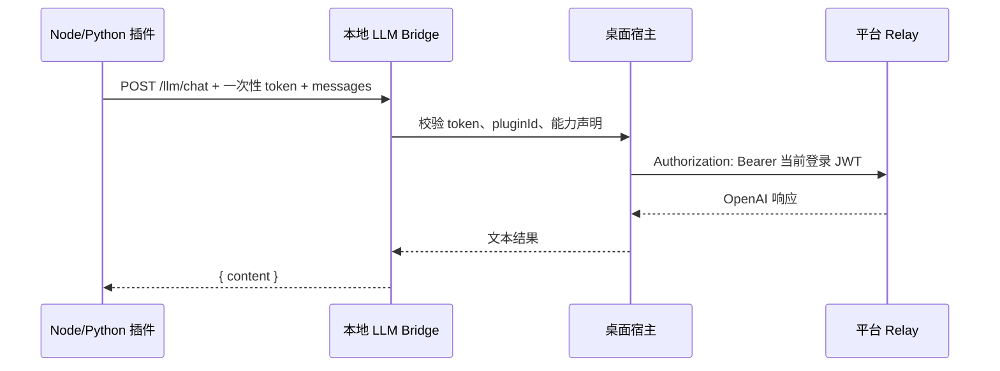

# 技术设计：插件 LLM、AI 工作流与 Beta 更新

## 1. 模块边界

### 平台 Relay

已有 `apps/collab-api/src/modules/relay/*` 是唯一 LLM 出口。本任务不改变计费、渠道路由和日志模型，只把插件侧调用都收敛到这个出口。

### HTML/client 插件

HTML 插件通过 iframe shim 调用宿主。宿主读取当前登录态，转发到 `/api/relay/v1/chat/completions`，返回纯文本。运行时必须绑定当前 `LoadedPlugin.id`，不信任 iframe 传入的 pluginId。

### Node.js/Python 插件

脚本插件是独立进程，不能使用 iframe postMessage。设计采用“宿主受控本地桥”：



- Bridge 仅监听 `127.0.0.1`，端口由宿主分配。
- 每个脚本启动生成短生命周期 token，脚本只拿 `LINGFANG_PLUGIN_BRIDGE_URL` 与 `LINGFANG_PLUGIN_BRIDGE_TOKEN`。
- token 只能访问当前插件，不能跨插件复用。
- Bridge 校验 manifest 中是否声明 `llm.chat`。
- Bridge 不暴露 JWT、平台 API Key 或上游 key。

### AI 创建器

创建器现有工具链已有 `ask_question`、`web_search`、`stage_plugin`、`patch_draft_file`。本任务新增检查与 review 工具，并在系统提示词里把流程显性化。

### Release/Beta

后端模型已具备 `ReleaseChannel`。本任务主要补测试和前端偏好流：

```mermaid
graph LR
  A[用户偏好 lf:update-channel] --> B{BETA?}
  B -->|否| C[STABLE]
  B -->|是| D[BETA]
  C --> E[check_update]
  D --> E
  E --> F[/api/releases/latest?channel=...]
```

## 2. 数据与配置

### 插件 LLM 请求

内部标准形态：

```ts
type PluginLlmChatInput = {
  messages: Array<{ role: 'system' | 'user' | 'assistant'; content: string }>;
  model?: 'fast' | 'premium';
};
```

宿主返回：

```ts
type PluginLlmChatResult = string;
```

脚本桥响应：

```json
{ "content": "..." }
```

### Beta 偏好

- localStorage key：`lf:update-channel`
- 值：`STABLE` 或 `BETA`
- 默认：`STABLE`

## 3. 文件职责变化

### Contract / SDK

- `packages/contract/src/plugin.ts`
  - 确认 `llm.chat` 是正式能力。
  - 如果新增脚本桥辅助能力，只在必要时加契约，不扩大未实现能力集合。
- `packages/plugin-sdk/src/index.ts`
  - 保持 `sdk.llm.chat(input)`。
  - 增加对脚本运行环境的轻量适配：若 `__lingfangInvoke` 不存在但存在本地桥环境变量，则调用桥。

### Desktop frontend

- `apps/desktop/src/pages/plugins-runtime.ts`
  - 抽出 `invokePluginLlmChat()`，HTML 插件和脚本桥共享同一请求构造与错误归一化。
- `apps/desktop/src/lib/plugin-creator/creator-tools.ts`
  - 新增 `check_plugin`、`review_plugin`。
- `apps/desktop/src/components/creator/FloatingCreator.tsx`
  - 系统提示词改为强制工作流。
  - 展示工作流状态。
- `apps/desktop/src/pages/Settings.tsx` / `apps/desktop/src/lib/updater.ts` / `apps/desktop/src/App.tsx`
  - 更新通道偏好和 beta 开关。

### Tauri Rust

- `apps/desktop/src-tauri/src/plugin_runner.rs`
  - 持久化运行时注入本地桥环境变量。
- `apps/desktop/src-tauri/src/plugin_script.rs`
  - 创建期预览运行也注入本地桥环境变量。
- 新增或拆分 Rust bridge 模块（优先避免继续放大大文件）：
  - `plugin_llm_bridge.rs`：bridge state、token、请求处理。
  - Tauri command 或 managed state 提供启动/停止桥生命周期。

### Collab API / Admin

- `apps/collab-api/src/modules/release.service.spec.ts`
  - 补 STABLE/BETA 互不影响测试。
- `apps/collab-admin/src/components/landing/DownloadPage.tsx`
  - 增加 beta 手动查看入口。
- `apps/collab-admin/src/components/releases-view.tsx`
  - 加强通道提示。

## 4. 安全策略

- 插件脚本不能读取平台登录 token。
- 脚本桥只允许 localhost。
- token 按插件启动会话生成，不写入磁盘。
- LLM 能力必须声明后才能调用。
- 检查/review 工具对以下内容视为高风险：
  - `sk-` 风格密钥；
  - `api.openai.com`、`/chat/completions` 等第三方模型直连；
  - 让用户输入上游 API Key 的 UI；
  - 未声明 `llm.chat` 却调用 LLM。

## 5. 兼容性

- HTML 插件继续兼容已有 `sdk.llm.chat`。
- 旧插件如果直接用 `net.fetch` 连第三方 LLM，不会被运行时强制拦截，但创建器和 review 会阻止新生成/新提交草稿走这条路径。
- beta 偏好只影响客户端更新检查，不影响已发布版本数据结构。

## 6. 回滚点

- 脚本桥可独立关闭：Node/Python 插件仍可按原独立进程方式运行，只是不具备平台 LLM 能力。
- beta 开关只读 localStorage，移除后默认回到 STABLE。
- 创建器新增工具失败时应返回 `{ ok:false, message }`，不阻断现有 stage/patch 流程。
