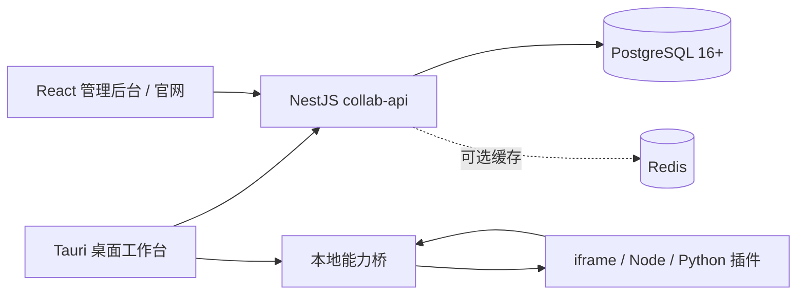

<div align="center">

# LingFang

**AI 插件创建、运行、发行与团队协作平台**

[](#环境要求)
[](#环境要求)
[](https://nestjs.com/)
[](https://tauri.app/)
[](https://react.dev/)
[](https://www.typescriptlang.org/)

</div>

LingFang 把对话式插件创建、本地隔离运行、v4 插件发行、市场购买、模型 relay、灵石计费、团队 RBAC 与平台治理放在同一套产品中。桌面端与管理端共享 `apps/collab-api` 后端和同一数据库。

> **Beta 平台支持说明**：当前 Beta 阶段**仅支持 Windows x64**。桌面客户端为 Windows 原生安装包，不提供 macOS / Linux 构建产物。非 Windows 环境暂无法安装与运行。

## 功能概览

- 对话式插件创建器：流式推理、文件工具、多轮迭代、上下文压缩和草稿工作区。
- 五类插件运行时：`client`、`nodejs`、`python`、`cloud`、`workflow`。
- v4 插件系统：确定性 `.lfplugin`、不可变 release、审核、货架、购买、授权、更新与回滚。
- 平台能力网关：文件、网络、剪贴板、系统、LLM、图片、视频、动作和共享状态。
- 模型 relay：平台档位、渠道路由、灵石计费、调用日志、视频按秒结算与失败退款。
- 团队协作：成员、两级 RBAC、余额、审计、通知、工单和公开团队。
- 本地自动化：cron/once 定时任务、Agent prompt、通知、插件动作、历史与勿扰时段。
- 管理后台：用户/团队、v4 发行版审核、市场结算、价目表、平台设置和桌面版本发布。

## 架构



| 子系统                     | 技术                     | 主要职责                                           |
| -------------------------- | ------------------------ | -------------------------------------------------- |
| `apps/desktop`             | Tauri 2 + React + Vite   | 创建、安装、运行、市场、本地能力、工作流和定时任务 |
| `apps/collab-api`          | NestJS 11 + Prisma 7     | 身份、团队、v4 注册中心、市场、relay、计费和治理   |
| `apps/collab-admin`        | React + Vite + shadcn/ui | 官网、审核、用户/团队、计费配置和平台设置          |
| `packages/contract`        | Zod                      | 跨运行时共享契约                                   |
| `packages/plugin-sdk`      | TypeScript               | SDK、manifest 校验器和 `lingfang-plugin` CLI       |
| `packages/workflow-engine` | TypeScript               | 工作流定义与执行辅助                               |

更完整的边界与数据流见 [愿景与架构](docs/01-vision-and-architecture.md)。

## 快速开始

### 环境要求

| 工具       | 版本                            |
| ---------- | ------------------------------- |
| Node.js    | 20+                             |
| pnpm       | 9+                              |
| PostgreSQL | 16+（不支持 MySQL/MariaDB）     |
| Rust/Cargo | 构建 Tauri 桌面端时需要         |
| Redis      | 可选                            |

### 一键启动

```powershell
pnpm install
pnpm start
```

`pnpm start` 调用 `tools/start.ps1`：

1. 检查 pnpm 和 `apps/collab-api/.env`；缺失时从 `.env.example` 复制。
2. 按 `DATABASE_PROVIDER` / `DATABASE_URL` 检查数据库。
3. 运行 Prisma generate、deploy 和平台管理员 seed。
4. 启动 collab-api，并等待 `/api/health`。
5. 未传 `-SkipDesktop` 时启动 Tauri；桌面退出后清理后端子进程。

仓库示例 `.env` 使用 `PORT=19006`；代码未设置 `PORT` 时回退 3000。管理端开发端口是 19005，桌面 Vite 端口是 1420，插件中心 Web 前端开发端口是 19007（dev 时 `/api` 默认代理到 `collab-api` 的 19006，可用 `VITE_API_PROXY_TARGET` 覆盖）。

```powershell
# 仅启动后端
pnpm start:backend

# 分别开发
pnpm -C apps/collab-api dev
pnpm -C apps/collab-admin dev
pnpm -C apps/desktop dev
pnpm -C apps/web dev   # 插件中心 Web 前端，默认 http://localhost:19007
```

开发环境 Swagger：`http://localhost:19006/api/docs`。

## 插件开发

### 一行起工程

```powershell
pnpm plugin:create demo --runtime client
pnpm plugin:validate .\demo
pnpm plugin:build .\demo --out .\demo.lfplugin
```

`lingfang-plugin create` 提供三套模板：

| 模板     | 入口            | 适用场景                      |
| -------- | --------------- | ----------------------------- |
| `client` | `ui/index.html` | iframe UI 与 SDK 能力         |
| `nodejs` | `index.js`      | Node 本地工具与自动化         |
| `python` | `main.py`       | 图像、视频、数据处理和桌面 UI |

平台契约还支持 `cloud` 和 `workflow`，它们由动作/工作流工具链生成。Manifest 上传可见性只允许 `private` 或 `tenant`；公开上架由审核决定。

```powershell
pnpm plugin:publish .\demo `
  --base http://localhost:19006 `
  --token <JWT> `
  --source-kind EXTERNAL_TOOL
```

深入阅读：

- [插件开发指南](docs/plugin-development/README.md)
- [SDK 使用指南](docs/sdk-guide/README.md)
- [Manifest 清单](docs/plugin-development/01-manifest.md)
- [构建与打包](docs/plugin-development/06-build-and-package.md)
- [插件注册中心 API](docs/api-reference/plugin-registry.md)

## 内置插件

下表名称与 `apps/desktop/builtin-plugins/*/manifest.json` 的 `name` 字段一致。

| 目录                | Manifest ID                 | 名称           | 运行时 |
| ------------------- | --------------------------- | -------------- | ------ |
| `ai-example`        | `builtin.ai-example`        | AI 能力实例    | client |
| `ai-python-example` | `builtin.ai-python-example` | Python AI 实例 | python |
| `calculator`        | `builtin.calculator`        | 计算器         | python |
| `game-2048`         | `builtin.game-2048`         | 2048 小游戏    | nodejs |
| `notes`             | `builtin.notes`             | Markdown 笔记  | client |

`plugins/` 还包含 summarizer、detail-poster、outfit-batch、qianniu-panel、rbflow-video 等可发布插件源码。

内置插件遵循**离线契约**：零第三方依赖、开箱即跑（全新电脑下载即用，无需联网安装）。该契约由 `pnpm verify:builtin` 持续校验。

内置插件遵循**离线契约**：零第三方依赖、开箱即跑（全新电脑无需联网安装）。该契约由 `pnpm verify:builtin` 持续校验。

## 常用命令

```powershell
pnpm -r typecheck
pnpm -r test
pnpm -C apps/collab-api build
pnpm -C apps/collab-admin build
pnpm -C apps/desktop vite:build
cargo test -p lingfang-desktop
```

| 根脚本                 | 作用                  |
| ---------------------- | --------------------- |
| `pnpm start`           | 后端准备 + 桌面端     |
| `pnpm start:backend`   | 只启动后端            |
| `pnpm package:source`  | 源码 zip（非安装包）  |
| `pnpm typecheck`       | 全 workspace 类型检查 |
| `pnpm test`            | 全 workspace 测试     |
| `pnpm plugin:create`   | 创建插件工程          |
| `pnpm plugin:validate` | 校验插件              |
| `pnpm plugin:build`    | 构建 v4 制品          |
| `pnpm plugin:publish`  | 发布插件              |

## 项目结构

```text
lingfang-platform/
├─ apps/
│  ├─ collab-api/       NestJS + Prisma 统一后端
│  ├─ collab-admin/     管理后台与官网
│  ├─ desktop/          React 工作台 + Tauri Rust 壳
│  ├─ plugin-preview/   Web 插件预览
│  └─ web/              Web 市场相关前端
├─ packages/
│  ├─ contract/         Zod 契约真源
│  ├─ plugin-sdk/       SDK + CLI
│  ├─ ui-tokens/        插件设计令牌
│  └─ workflow-engine/  工作流辅助
├─ plugins/             可发布插件源码
├─ docs/                产品、工程、API 与开发文档
├─ tools/               启动与分发脚本
└─ .trellis/            规格、任务和开发日志
```

当前 `apps/collab-api/prisma/migrations/` 有 48 个 migration 目录；`docs/adr/` 有 5 篇 ADR；API 参考索引覆盖 50 个控制器类。

## 环境变量

完整示例见 `apps/collab-api/.env.example`。

| 变量                            | 说明                              |
| ------------------------------- | --------------------------------- |
| `PORT`                          | API 监听端口；示例为 19006        |
| `DATABASE_PROVIDER`             | 仅支持 `postgresql`               |
| `DATABASE_URL`                  | 数据库连接串                      |
| `CACHE_DRIVER` / `REDIS_URL`    | 可选缓存                          |
| `JWT_SECRET` / `JWT_EXPIRES_IN` | JWT 签名与有效期                  |
| `CORS_ALLOWED_ORIGINS`          | 管理端和 Tauri origin 白名单      |
| `LLM_KEY_ENCRYPTION_KEY`        | 团队模型密钥 AES-256-GCM 加密密钥 |
| `PLATFORM_ADMIN_*`              | 首次管理员 seed                   |
| `SMTP_URL` / `SMTP_FROM`        | 邮件服务 fallback                 |
| `PASSWORD_RESET_BASE_URL`       | 密码重置链接前缀                  |
| `EMAIL_VERIFY_BASE_URL`         | 邮箱验证链接前缀                  |

部署细节见 [部署指南](docs/collab-deployment.md)。

## 文档

### 架构、领域与工程

- [愿景与架构](docs/01-vision-and-architecture.md)
- [领域模型与插件](docs/02-domain-and-plugins.md)
- [后端与模型 Relay](docs/03-backend-and-llm.md)
- [工程规范](docs/04-engineering.md)
- [灵石计费与 Relay 设计](docs/billing-and-relay-design.md)

### 产品与部署

- [管理后台指南](docs/collab-admin-guide.md)
- [Collab API 概览](docs/collab-api.md)
- [部署指南](docs/collab-deployment.md)
- [桌面客户端](docs/collab-desktop-client.md)
- [插件开发入口](docs/plugin-development.md)

### 新文档目录

- [插件开发指南](docs/plugin-development/README.md) — 10 篇章节文档
- [HTTP API 参考](docs/api-reference/README.md) — 50 个控制器类、全部装饰器端点
- [SDK 使用指南](docs/sdk-guide/README.md) — 安装、API、校验器、CLI、类型与桥接
- [ADR](docs/adr/) — 5 篇架构决策记录

历史实测与旧架构快照已移入 `.trellis/evidence/archive/`，不再作为当前产品文档。

## 开发约定

1. 写代码前读取 `.trellis/spec/` 中对应层规范。
2. 跨层字段先改 `packages/contract`，再同步服务端、桌面与 SDK。
3. 新行为增加单测，Bug 修复增加回归测试。
4. 数据模型变更附 Prisma migration，并验证 PostgreSQL 路径。
5. `.lfplugin` 只能用 SDK CLI 构建，不能手工压缩。
6. 不在插件、日志、UI 或文档中暴露平台密钥、桥 token 或供应商凭证。

## License

本仓库是私有项目，未声明开源 License。使用、分发或二次开发前请联系维护者。
