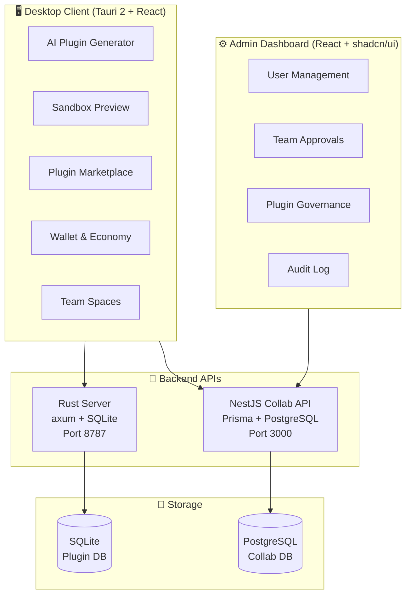

<p align="center">
  
</p>

<h1 align="center">LingFang</h1>
<p align="center">AI-powered no-code plugin generation platform</p>

<p align="center">
  
  
  
  
  
  
</p>

---

## Architecture



**Two independent systems, one platform:**

| System | Stack | Database | Role |
|--------|-------|----------|------|
| **AI Plugin Engine** | Rust + axum | SQLite (embedded) | Plugin generation, LLM proxy, marketplace, wallet |
| **Collab Platform** | NestJS + Prisma | PostgreSQL | Multi-tenant teams, RBAC, admin panel |

---

## Features

### 🧠 AI Plugin Generation
Describe features in natural language → AI generates runnable plugins with streaming preview. Iterate conversationally, publish to marketplace.

- **Streaming generation** with real-time reasoning display (SSE + `reasoning_content`)
- **Conversational iteration** — refine plugins through chat
- **Plugin sandbox** — instant preview before publishing

### 🏪 Marketplace & Economy
- Search, rate, install plugins
- Wallet system with balance and purchase flow
- Built-in plugins: file explorer, system info, todo list

### 👥 Multi-tenant Collaboration *(new)*
- **Teams** with roles: Admin → Member
- **Team admin applications** with approval workflow
- **Shared balance** and ledger for team plugins
- **Admin dashboard** for platform governance

---

## Quick Start

### Prerequisites

```bash
# AI Plugin Engine (no Docker needed)
cargo ≥ 1.80        # Rust toolchain
pnpm ≥ 9            # Node package manager

# Collab Platform
Node.js ≥ 20
PostgreSQL 16       # Docker: docker compose up -d
```

### AI Plugin Engine (one command)

```bash
pnpm install
pnpm start          # Starts Rust backend + Tauri desktop
```

- Backend: `http://127.0.0.1:8787`
- Desktop: auto-launches as native window

### Collab Platform

```bash
pnpm install
cp apps/collab-api/.env.example apps/collab-api/.env
pnpm -C apps/collab-api db:setup        # prisma generate + migrate + seed
pnpm -C apps/collab-api dev             # API → :3000
VITE_COLLAB_API_BASE=http://localhost:3000 pnpm -C apps/collab-admin dev  # Admin → :4174
```

**Docker alternative:**

```bash
docker compose -f docker-compose.collab.yml up -d
```

| Endpoint | URL |
|----------|-----|
| Collab API | `http://localhost:3000` |
| Swagger UI | `http://localhost:3000/api/docs` |
| Admin Panel | `http://localhost:4174` |

---

## Project Structure

```
lingfang/
├── apps/
│   ├── desktop/          Tauri 2 + React desktop client
│   │   ├── src/                  UI pages, components, API layer
│   │   ├── src-tauri/            Rust capability gateway
│   │   └── builtin-plugins/      Todo, File Explorer, System Info
│   ├── server/           Rust backend (axum + SQLite)
│   │   ├── src/routes/           Auth, drafts, marketplace, wallet, LLM
│   │   └── migrations/           SQLite schema
│   ├── collab-api/       NestJS collaboration API (Prisma + PostgreSQL)
│   │   └── prisma/               Data model, migrations, seed
│   └── collab-admin/     Web admin dashboard (React + shadcn/ui)
│       └── src/components/       Users, Teams, Plugins, Approvals, Audit
├── packages/
│   ├── contract/         Zod schemas — single source of truth
│   ├── plugin-sdk/       Plugin capability SDK for runtime
│   └── ui-tokens/        Design tokens (CSS custom properties)
├── plugins/
│   └── summarizer/       Example plugin: LLM-based text summarizer
├── docs/                 Architecture, API, deployment, ADRs
├── tools/                Startup scripts, logo generator
└── docker-compose*.yml   Docker configs for PostgreSQL + Collab stack
```

---

## Configuration

All environment variables have sensible defaults for local development. See `.env.example` and `.env.collab.example` for the full list.

| Variable | Default | Scope |
|----------|---------|-------|
| `BIND_ADDR` | `127.0.0.1:8787` | Rust server |
| `DATABASE_URL` | `sqlite:lingfang.db` | Rust server |
| `DATABASE_URL` | `postgresql://...` | Collab API |
| `JWT_SECRET` | dev placeholder | Both |

Deploy with `BIND_ADDR=0.0.0.0:8787` and set `CORS_ALLOWED_ORIGINS` for network access.

---

## Documentation

| Document | Topic |
|----------|-------|
| [Vision & Architecture](docs/01-vision-and-architecture.md) | Product vision, system design |
| [Domain & Plugins](docs/02-domain-and-plugins.md) | Entity model, plugin manifest, SDK |
| [Backend & LLM](docs/03-backend-and-llm.md) | API design, auth, LLM gateway |
| [Engineering](docs/04-engineering.md) | Monorepo conventions, config |
| [Collab Platform](docs/collab-platform.md) | Multi-tenant architecture |
| [Collab API](docs/collab-api.md) | API reference |
| [Collab Deployment](docs/collab-deployment.md) | Docker & manual deployment |
| [ADR](docs/adr/) | Architecture Decision Records (5 docs) |

---

## Verification

```bash
cargo test -p server              # Rust unit tests
pnpm -C apps/desktop typecheck    # Desktop typecheck
pnpm -C apps/collab-api typecheck # API typecheck
pnpm -C apps/collab-admin build   # Admin build
```

---

## Design Principles

1. **Contract-first** — Zod schemas in `packages/contract` drive all implementations
2. **No reinventing wheels** — use battle-tested tools (axum, NestJS, Prisma, shadcn/ui)
3. **Platform stays neutral** — routes LLM requests, doesn't handle billing
4. **Locally verifiable** — SQLite embedded DB, zero-dependency startup
5. **Minimal deployable** — single binary (Rust server) + static files (admin panel)