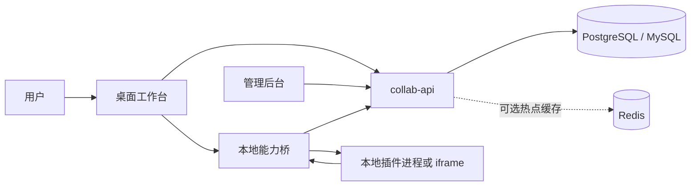

# 愿景与架构

LingFang 是一个以插件为交付单元的 AI 工作台：用户在桌面端创建、运行和安装插件，团队通过统一平台管理身份、权限、发行版、市场、计费与审计。

## 系统边界

| 子系统 | 技术 | 职责 |
|---|---|---|
| `apps/desktop` | Tauri 2 + React | 插件创建、安装、运行、本地能力、工作流与定时任务 |
| `apps/collab-admin` | React + Vite | 官网、平台管理、审核、计费配置与治理 |
| `apps/collab-api` | NestJS + Prisma | 认证、团队、RBAC、v4 插件注册中心、市场、relay、钱包与审计 |
| `packages/contract` | Zod + TypeScript | 跨运行时契约真源 |
| `packages/plugin-sdk` | TypeScript | 插件能力客户端、manifest 校验和 CLI |

## 核心原则

1. 契约先行：共享字段先进入 `packages/contract`。
2. 单一服务端：桌面端和管理端使用同一套 API 与数据库。
3. 不可变发行版：v4 `PluginPackage` 表示身份，`PluginRelease` 表示不可变制品。
4. 能力最小化：插件只能调用 manifest 声明并经宿主授权的能力。
5. 平台托管 AI：供应商凭证、模型路由、计费和审计留在平台侧。
6. 本地可恢复：安装、更新、回滚、定时任务和插件数据使用原子文件或账本写入。

## 数据流

## 进一步阅读

- [领域模型与插件](./02-domain-and-plugins.md)
- [后端与模型 relay](./03-backend-and-llm.md)
- [桌面客户端](./collab-desktop-client.md)
- [HTTP API 参考](./api-reference/README.md)
