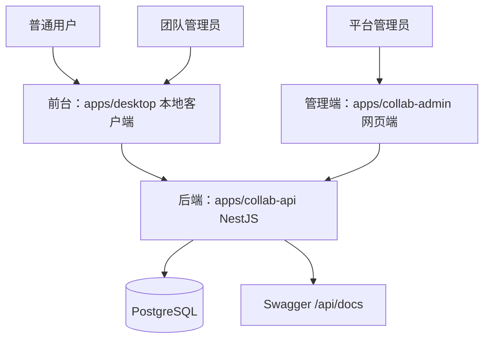

# 三平台多租户协作系统

## 平台边界



- 前台：普通用户和团队管理员使用本地客户端。
- 管理端：平台管理员使用网页端。
- 后端：所有认证、权限、团队、插件、余额、审批和审计都在统一 API 中完成。

## 角色

| 角色 | 入口 | 能力 |
| --- | --- | --- |
| 平台管理员 | 网页管理端 | 用户、团队、插件、审批、余额、审计 |
| 团队管理员 | 本地客户端 | 所属团队成员、邀请码、余额流水 |
| 普通用户 | 本地客户端 | 加入团队、查看团队空间、使用可用插件 |

平台管理员登录本地客户端时会被提示使用网页管理端。普通用户或团队管理员登录网页管理端时会被拒绝。

## 初始管理员

初始平台管理员由 `apps/collab-api` 的 seed/bootstrap 创建：

```bash
pnpm -C apps/collab-api seed:admin
```

需要环境变量：

- `PLATFORM_ADMIN_BOOTSTRAP_ENABLED=true`
- `PLATFORM_ADMIN_EMAIL`
- `PLATFORM_ADMIN_PASSWORD`
- `PLATFORM_ADMIN_NAME`

规则：

- 如果已经存在平台管理员，不重复创建，也不覆盖密码。
- 如果邮箱已存在且尚无平台管理员，则提升该用户为平台管理员。
- 生产初始化完成后建议关闭 `PLATFORM_ADMIN_BOOTSTRAP_ENABLED`。

## 业务流程

1. 平台管理员通过 seed 创建初始账号。
2. 平台管理员登录网页管理端，创建团队、设置余额、启用插件。
3. 普通用户在本地客户端注册，输入邀请码加入团队。
4. 团队管理员在本地客户端注册时提交申请。
5. 平台管理员在网页管理端审批团队管理员申请。
6. 团队管理员在本地客户端管理成员、邀请码和余额流水。
7. 插件启用/禁用由平台管理员控制，本地客户端只显示启用插件。

## 数据隔离

- 团队域数据必须归属某个团队。
- 团队管理员只能访问所属团队。
- 普通用户只能访问所属团队授权数据。
- 平台管理员接口统一放在 `/api/admin/*`，由后端校验平台角色。

## 双后端 → collab-api 收敛现状（2026-06-13）

> 本节说明平台当前正从 Rust 双后端形态收敛到统一 NestJS collab-api 的进展与约束。**活跃后端契约权威为 [docs/collab-api.md](collab-api.md)。**

### 收敛方向

- 当前正在将桌面客户端（`apps/desktop`）从 Rust **apps/server**（`:8787`，路径**无 `/api` 前缀**）收敛到 NestJS **collab-api**（`:3000`，路径**带 `/api` 前缀**）。
- LLM 生成、钱包、市场、审核、`/llm/*`、`/marketplace/*`、`/wallet`、`/admin/review/*` 已在 commit `7ef4bf0` 迁移到 collab-api（迁移映射见 [docs/03-backend-and-llm.md](03-backend-and-llm.md) §2.2）。
- Rust apps/server 仅保留身份、租户、插件草稿 CRUD 与目录安装/授权的旧契约骨架（实际路由见 [docs/03-backend-and-llm.md](03-backend-and-llm.md) §2.1）。

### 多团队切换功能已移除

- 旧的 `TenantSelect` 多团队切换（对应 Rust 的 `POST /auth/switch-tenant`）**已移除**。
- collab-api 采用「**单当前团队** + 邀请码」模型：普通用户通过 `POST /api/invitations/redeem` 凭邀请码加入团队，团队管理员通过 `POST /api/team-admin-applications` 提交申请、由平台管理员审批后获得团队。
- 团队归属与权限以 collab-api 的当前团队上下文为准，不再支持运行时在多个团队间切换。

### JWT 不互通（临时约束）

- Rust apps/server 与 collab-api 当前的 **JWT claims 结构与签名 secret 不互通**，两套后端各自签发/校验 token。
- 收敛完成（桌面端全面切到 collab-api）后，将统一为 collab-api 的 JWT 契约，apps/server 的鉴权随之退役。
- 在收敛过渡期内，桌面端面向哪个后端，就使用哪个后端的登录态，不跨后端复用 token。

### 权威契约指引

- 活跃后端（团队/插件/余额/审批/审计/LLM 代理）契约：[docs/collab-api.md](collab-api.md)。
- 部署与端口：[docs/collab-deployment.md](collab-deployment.md)。
- 旧 Rust 路由与迁移脉络（仅历史保留）：[docs/03-backend-and-llm.md](03-backend-and-llm.md)。