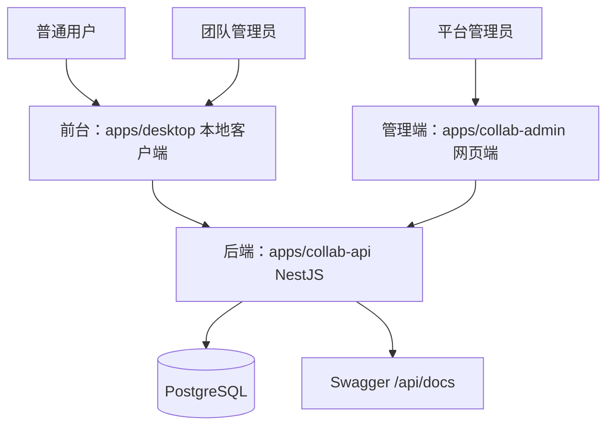

# 三平台多租户协作系统

## 平台边界



- 前台：普通用户和团队管理员使用本地客户端。
- 管理端：平台管理员使用网页端。
- 后端：所有认证、权限、团队、插件、余额、审批和审计都在统一 API 中完成。

## 角色

| 角色 | 入口 | 能力 |
| --- | --- | --- |
| 平台管理员 | 网页管理端 | 用户、团队、插件、审批、余额、审计 |
| 团队管理员 | 本地客户端 | 所属团队成员、邀请码、余额流水 |
| 普通用户 | 本地客户端 | 加入团队、查看团队空间、使用可用插件 |

平台管理员登录本地客户端时会被提示使用网页管理端。普通用户或团队管理员登录网页管理端时会被拒绝。

## 初始管理员

初始平台管理员由 `apps/collab-api` 的 seed/bootstrap 创建：

```bash
pnpm -C apps/collab-api seed:admin
```

需要环境变量：

- `PLATFORM_ADMIN_BOOTSTRAP_ENABLED=true`
- `PLATFORM_ADMIN_EMAIL`
- `PLATFORM_ADMIN_PASSWORD`
- `PLATFORM_ADMIN_NAME`

规则：

- 如果已经存在平台管理员，不重复创建，也不覆盖密码。
- 如果邮箱已存在且尚无平台管理员，则提升该用户为平台管理员。
- 生产初始化完成后建议关闭 `PLATFORM_ADMIN_BOOTSTRAP_ENABLED`。

## 业务流程

1. 平台管理员通过 seed 创建初始账号。
2. 平台管理员登录网页管理端，创建团队、设置余额、启用插件。
3. 普通用户在本地客户端注册，输入邀请码加入团队。
4. 团队管理员在本地客户端注册时提交申请。
5. 平台管理员在网页管理端审批团队管理员申请。
6. 团队管理员在本地客户端管理成员、邀请码和余额流水。
7. 插件启用/禁用由平台管理员控制，本地客户端只显示启用插件。

## 数据隔离

- 团队域数据必须归属某个团队。
- 团队管理员只能访问所属团队。
- 普通用户只能访问所属团队授权数据。
- 平台管理员接口统一放在 `/api/admin/*`，由后端校验平台角色。